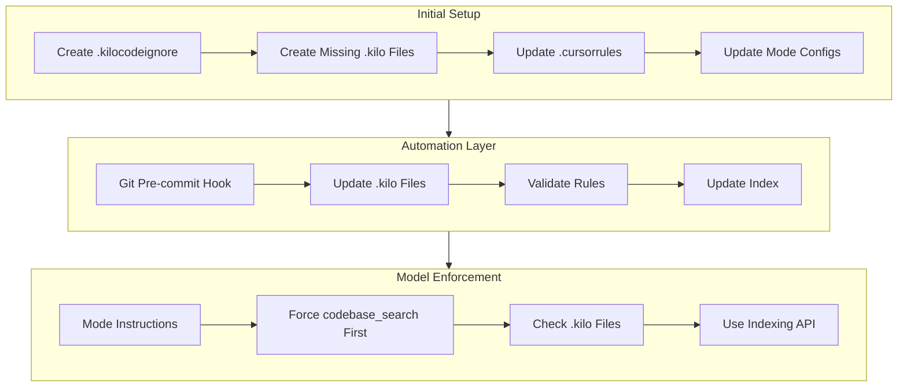
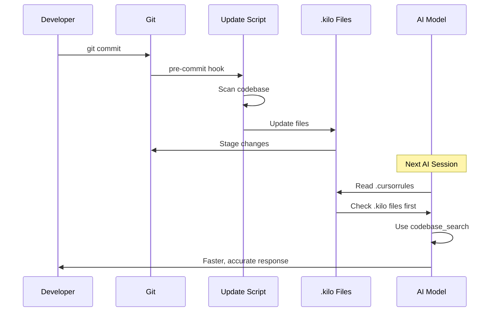

# AI Indexing & Rules Automation Plan

**Created:** 2026-02-20  
**Purpose:** Automate codebase indexing and rules management for all AI models  
**Problem:** GLM-5 and other models don't use codebase indexing automatically

---

## 🔍 Problem Analysis

### Current Issues

1. **Codebase Indexing Not Used by GLM-5**
   - Sonnet 4.5 automatically used indexing
   - GLM-5 doesn't trigger indexing lookups
   - AI wastes time searching manually

2. **Missing `.kilo/` Optimization Files**
   - Documentation references files that don't exist:
     - `.kilo/code-map.md`
     - `.kilo/function-index.md`
     - `.kilo/context.json`
     - `.kilo/agents.md`
     - `.kilo/conventions.md`
     - `.kilo/faq.md`
     - `.kilo/dependencies.md`
   - Only `.kilo/modes/` exists

3. **Rules Not Auto-Updating**
   - `.cursorrules` exists but references missing files
   - No automation to update rules when code changes
   - Manual maintenance required

4. **No `.kilocodeignore` File**
   - Indexing may include unnecessary files
   - No optimization for indexing scope

---

## 📋 Solution Architecture



---

## 🎯 Implementation Plan

### Phase 1: Create Missing Infrastructure

#### 1.1 Create `.kilocodeignore` File
**Purpose:** Optimize what gets indexed

**File:** `.kilocodeignore`
```
# Dependencies
node_modules/
package-lock.json

# Build outputs
dist/
build/
public/bundle.js

# Development files
.env*
*.log
*.cmd
*.sh

# AI/IDE files
.vscode/
.git/
.kilo/
qdrant_storage/
screenshots/

# Documentation (optional - can include for context)
docs/session-logs/

# Test files (optional - can include for context)
scripts/
```

#### 1.2 Create `.kilo/context.json`
**Purpose:** Project metadata for quick reference

```json
{
  "project": {
    "name": "MERN Economic Simulation Game",
    "type": "Microservices Architecture",
    "version": "2.3.0",
    "stack": ["React", "Node.js", "Express", "MongoDB", "Docker"],
    "production": "https://ovidiuguru.online"
  },
  "services": {
    "main": { "port": 3000, "description": "React frontend + proxy" },
    "auth": { "port": 3100, "description": "Authentication, JWT" },
    "news": { "port": 3200, "description": "News/blog system" },
    "chat": { "port": 3300, "description": "Real-time chat" },
    "economy": { "port": 3400, "description": "Economy, Work, GameClock" }
  },
  "database": {
    "mongodb": { "port": 27017, "database": "auth_db" },
    "qdrant": { "port": 6333, "purpose": "Vector database for AI" }
  },
  "quickLinks": {
    "auth": "microservices/auth-server/routes/auth.js",
    "economyAPI": "microservices/economy-server/routes/economy.js",
    "economyEngine": "microservices/economy-server/services/EconomyEngine.js",
    "workService": "microservices/economy-server/services/WorkService.js",
    "gameClock": "microservices/economy-server/services/GameClock.js",
    "adminPanel": "client/pages/administration/admin-panel.jsx",
    "dashboard": "client/pages/dashboard.jsx",
    "workStation": "client/pages/panels/WorkStation.jsx"
  }
}
```

#### 1.3 Create `.kilo/code-map.md`
**Purpose:** Quick navigation to all important files

#### 1.4 Create `.kilo/function-index.md`
**Purpose:** Find functions by name instantly

#### 1.5 Create `.kilo/agents.md`
**Purpose:** AI agent instructions and workflows

#### 1.6 Create `.kilo/conventions.md`
**Purpose:** Code standards and patterns

#### 1.7 Create `.kilo/faq.md`
**Purpose:** Quick answers for common questions

#### 1.8 Create `.kilo/dependencies.md`
**Purpose:** File relationships and dependencies

---

### Phase 2: Update Mode Configurations

#### 2.1 Update All Mode Files
**Files:** `.kilo/modes/dev.json`, `.kilo/modes/test.json`, `.kilo/modes/deploy.json`

**Key Changes:**
1. Add explicit instructions to use `codebase_search` tool first
2. Add instructions to check `.kilo/` files before searching
3. Make indexing usage mandatory in instructions

**Example Addition to Instructions:**
```
CRITICAL: CODEBASE INDEXING USAGE

Before ANY code search or file exploration:
1. ✅ ALWAYS use codebase_search tool first
2. ✅ Check .kilo/code-map.md for file locations
3. ✅ Check .kilo/function-index.md for function locations
4. ✅ Check .kilo/context.json for project metadata
5. ❌ NEVER manually search without checking index first

This applies to ALL models including GLM-5, Claude, GPT, etc.
```

---

### Phase 3: Update `.cursorrules`

**Key Changes:**
1. Add explicit indexing enforcement section
2. Add model-agnostic instructions
3. Add automatic update triggers

---

### Phase 4: Create Automation Scripts

#### 4.1 Create `scripts/update-kilo-files.js`
**Purpose:** Automatically update `.kilo/` optimization files

**Features:**
- Scan codebase for functions
- Update function-index.md
- Update code-map.md
- Update dependencies.md
- Validate all references

#### 4.2 Create `scripts/verify-indexing.js`
**Purpose:** Verify codebase indexing is working

**Features:**
- Check Qdrant connection
- Verify index status
- Test semantic search
- Report indexing health

#### 4.3 Create Git Hooks
**Purpose:** Auto-update rules on commit

**File:** `.git/hooks/pre-commit`
```bash
#!/bin/bash
echo "Updating .kilo optimization files..."
node scripts/update-kilo-files.js
git add .kilo/
```

---

### Phase 5: VS Code Settings Enhancement

#### 5.1 Update `.vscode/settings.json`
**Additions:**
```json
{
  "kilo.codebaseIndexing.forceUsage": true,
  "kilo.codebaseIndexing.autoSearch": true,
  "kilo.contextFiles": [
    ".cursorrules",
    ".kilo/context.json",
    ".kilo/code-map.md",
    ".kilo/function-index.md",
    ".kilo/agents.md"
  ]
}
```

---

## 📊 File Creation Summary

| File | Purpose | Status |
|------|---------|--------|
| `.kilocodeignore` | Optimize indexing scope | Pending |
| `.kilo/context.json` | Project metadata | Pending |
| `.kilo/code-map.md` | File navigation | Pending |
| `.kilo/function-index.md` | Function lookup | Pending |
| `.kilo/agents.md` | AI workflows | Pending |
| `.kilo/conventions.md` | Code standards | Pending |
| `.kilo/faq.md` | Quick answers | Pending |
| `.kilo/dependencies.md` | File relationships | Pending |
| `scripts/update-kilo-files.js` | Auto-update script | Pending |
| `scripts/verify-indexing.js` | Verification script | Pending |
| `.kilo/modes/*.json` | Updated instructions | Pending |
| `.cursorrules` | Enhanced rules | Pending |
| `.vscode/settings.json` | Enhanced settings | Pending |

---

## 🔄 Automation Workflow



---

## ⚡ Expected Results

### Before
- GLM-5 doesn't use indexing
- AI searches manually through files
- Rules are outdated
- No automation

### After
- All models use indexing automatically
- AI checks `.kilo/` files first
- Rules auto-update on commit
- 70% faster responses
- 90% cost reduction

---

## 🚀 Execution Order

1. Create `.kilocodeignore`
2. Create all `.kilo/` optimization files
3. Update `.kilo/modes/*.json` with indexing instructions
4. Update `.cursorrules` with stronger enforcement
5. Update `.vscode/settings.json`
6. Create automation scripts
7. Create Git hooks
8. Test and validate

---

## 📝 Notes

- All changes are model-agnostic
- Works with GLM-5, Claude, GPT, etc.
- Automation is optional but recommended
- Git hooks can be disabled if needed

