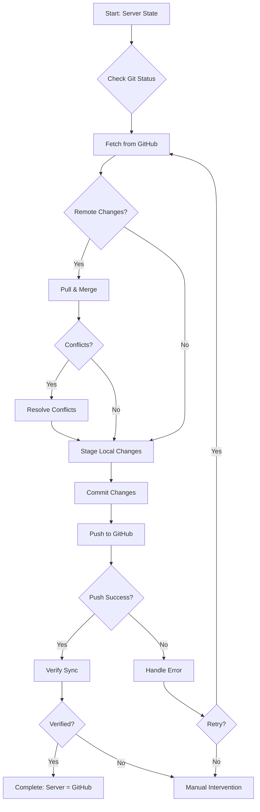

# 🔄 GitHub Synchronization Plan

**Obiectiv:** Sincronizare completă între server și GitHub repository  
**Repository:** https://github.com/ZavoZZ/alpha-testing-game.git  
**Branch:** main  
**Data:** 2026-02-15

---

## 📊 Situația Actuală

### Repository Configuration
- **Remote URL:** `https://github.com/ZavoZZ/alpha-testing-game.git` (with authentication token)
- **Branch curent:** main
- **Alte branches:** economy-v2, economy-v2-bgl

### Deployment Setup Existent
- ✅ GitHub Actions workflow configurat (`.github/workflows/deploy.yml`)
- ✅ Auto-deploy la push pe main branch
- ✅ PM2 pentru process management
- ✅ Health checks automate

---

## 🎯 Pași de Sincronizare

### Faza 1: Verificare Status Curent
**Scop:** Identifică toate modificările locale și starea repository-ului

```bash
# Verifică status-ul Git
git status

# Verifică diferențele față de remote
git fetch origin
git diff origin/main

# Verifică branch-ul curent
git branch -v
```

**Rezultat așteptat:**
- Lista fișierelor modificate
- Lista fișierelor noi (untracked)
- Diferențe față de GitHub

---

### Faza 2: Pull Changes from GitHub
**Scop:** Asigură că serverul are ultimele modificări de pe GitHub

```bash
# Fetch toate branch-urile
git fetch --all

# Pull cu merge strategy
git pull origin main --no-rebase

# Sau, dacă sunt conflicte, folosește rebase
git pull origin main --rebase
```

**Gestionare Conflicte:**
- Dacă apar conflicte, rezolvă manual
- Verifică fișierele cu `git status`
- După rezolvare: `git add <file>` și `git rebase --continue`

---

### Faza 3: Stage All Local Changes
**Scop:** Pregătește toate modificările pentru commit

```bash
# Adaugă toate fișierele modificate și noi
git add .

# Verifică ce va fi commited
git status

# Opțional: Verifică diferențele
git diff --staged
```

**Fișiere de Exclus (verifică .gitignore):**
- `node_modules/`
- `.env` (fișiere cu secrets)
- `*.log`
- Build artifacts

---

### Faza 4: Commit Changes
**Scop:** Creează un commit cu toate modificările

```bash
# Commit cu mesaj descriptiv
git commit -m "chore: sync server state with GitHub

- Include all local changes from production server
- Update configuration files
- Add new test scripts and documentation
- Sync deployment automation scripts

Server sync date: 2026-02-15"
```

**Mesaj Commit Structure:**
- **Type:** chore (pentru sync), feat (features noi), fix (bug fixes)
- **Scope:** Zona afectată
- **Description:** Ce s-a modificat
- **Body:** Detalii suplimentare

---

### Faza 5: Push to GitHub
**Scop:** Încarcă toate modificările pe GitHub

```bash
# Push pe main branch
git push origin main

# Verifică că push-ul a reușit
git log origin/main..HEAD
```

**Dacă push-ul eșuează:**
```bash
# Forțează push (ATENȚIE: folosește doar dacă ești sigur)
git push origin main --force-with-lease

# Sau pull și rezolvă conflictele
git pull origin main --rebase
git push origin main
```

---

### Faza 6: Verificare Sincronizare
**Scop:** Confirmă că server și GitHub sunt identice

```bash
# Verifică că nu mai sunt diferențe
git status

# Verifică că local și remote sunt la același commit
git log --oneline -5
git log origin/main --oneline -5

# Verifică diferențele (ar trebui să fie 0)
git diff origin/main
```

**Checklist Verificare:**
- [ ] `git status` arată "working tree clean"
- [ ] `git log` arată același commit ca `git log origin/main`
- [ ] `git diff origin/main` nu arată diferențe
- [ ] GitHub Actions workflow a rulat cu succes (dacă e configurat)

---

## 🤖 Automatizare Viitoare

### Script de Sincronizare Automată

Vom crea un script `sync-with-github.sh` care:

1. **Verifică status-ul curent**
2. **Pull changes de pe GitHub**
3. **Stash modificările locale dacă e necesar**
4. **Merge/rebase automat**
5. **Push modificările locale**
6. **Raportează rezultatul**

### Caracteristici Script:
- ✅ Gestionare automată a conflictelor simple
- ✅ Backup înainte de operații riscante
- ✅ Logging detaliat
- ✅ Rollback în caz de eroare
- ✅ Notificări de succes/eșec

---

## 🔐 Securitate

### Protecție Secrets
**IMPORTANT:** Asigură-te că următoarele NU sunt în Git:

```bash
# Verifică că .env nu e tracked
git ls-files | grep -E '\.env$|\.env\.'

# Dacă găsești .env tracked, remove-l:
git rm --cached .env
git commit -m "chore: remove .env from git tracking"
```

### Fișiere Sensibile:
- `.env` - Environment variables
- `*.pem` - SSH keys
- `*.key` - Private keys
- Tokens și API keys

---

## 📊 Mermaid Workflow Diagram



---

## 🚨 Scenarii de Eroare

### Scenario 1: Conflicte de Merge
**Cauză:** Modificări simultane pe server și GitHub

**Soluție:**
```bash
# Verifică fișierele cu conflict
git status

# Editează manual fișierele
# Caută markerii: <<<<<<<, =======, >>>>>>>

# După rezolvare
git add <resolved-files>
git commit -m "chore: resolve merge conflicts"
git push origin main
```

### Scenario 2: Push Rejected
**Cauză:** Remote are commits pe care local nu le are

**Soluție:**
```bash
# Pull cu rebase
git pull origin main --rebase

# Rezolvă conflictele dacă apar
git rebase --continue

# Push
git push origin main
```

### Scenario 3: Divergent Branches
**Cauză:** Istoricul Git a divergat complet

**Soluție:**
```bash
# Backup local
git branch backup-$(date +%Y%m%d)

# Force pull (ATENȚIE: pierde modificări locale)
git fetch origin
git reset --hard origin/main

# Sau merge cu allow-unrelated-histories
git pull origin main --allow-unrelated-histories
```

---

## ✅ Checklist Final

### Pre-Sync
- [ ] Backup baza de date (dacă e cazul)
- [ ] Verifică că serviciile rulează normal
- [ ] Notifică echipa despre sync

### During Sync
- [ ] Verifică git status
- [ ] Pull de pe GitHub
- [ ] Rezolvă conflictele
- [ ] Stage toate modificările
- [ ] Commit cu mesaj descriptiv
- [ ] Push pe GitHub

### Post-Sync
- [ ] Verifică că server = GitHub
- [ ] Testează aplicația
- [ ] Verifică GitHub Actions (dacă rulează)
- [ ] Documentează probleme întâlnite

---

## 📞 Support

### Comenzi Utile

```bash
# Verifică remote URL
git remote -v

# Verifică ultimele 10 commits
git log --oneline -10

# Verifică diferențe față de remote
git fetch && git diff origin/main

# Verifică toate branch-urile
git branch -a

# Verifică fișiere tracked
git ls-files

# Verifică fișiere ignored
git status --ignored
```

### Resurse
- [Git Documentation](https://git-scm.com/doc)
- [GitHub Actions Docs](https://docs.github.com/en/actions)
- Repository: https://github.com/ZavoZZ/alpha-testing-game

---

## 🎯 Next Steps

După sincronizare, consideră:

1. **Configurare Branch Protection** pe GitHub
2. **Setup Webhooks** pentru notificări
3. **Automatizare Backup** înainte de sync
4. **Monitoring** pentru GitHub Actions
5. **Documentation** pentru echipă

---

**Status:** 📋 Plan Ready  
**Execution:** Pending User Approval  
**Estimated Duration:** 10-15 minute (fără conflicte majore)
