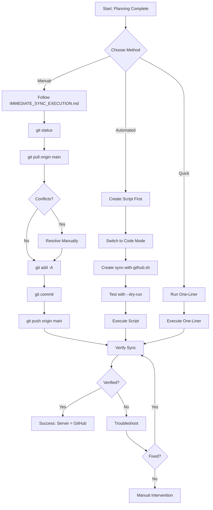

# 📋 GitHub Sync - Plan Summary

**Created:** 2026-02-15  
**Repository:** https://github.com/ZavoZZ/alpha-testing-game.git  
**Status:** Planning Complete - Ready for Execution

---

## 🎯 Obiectiv

Sincronizare completă între serverul de producție și GitHub repository, asigurând că ambele sunt identice.

---

## 📚 Documente Create

### 1. [`GITHUB_SYNC_PLAN.md`](./GITHUB_SYNC_PLAN.md)
**Scop:** Plan detaliat de sincronizare

**Conține:**
- Situația actuală a repository-ului
- Pași detaliați de sincronizare (6 faze)
- Gestionare conflicte
- Scenarii de eroare și soluții
- Checklist complet
- Mermaid workflow diagram

**Când să folosești:** Pentru înțelegerea completă a procesului de sync

---

### 2. [`SYNC_AUTOMATION_SCRIPT.md`](./SYNC_AUTOMATION_SCRIPT.md)
**Scop:** Script automat pentru sincronizare

**Caracteristici:**
- ✅ Backup automat înainte de operații
- ✅ Dry-run mode pentru preview
- ✅ Gestionare automată a conflictelor simple
- ✅ Logging detaliat
- ✅ Verificare post-sync
- ✅ Rollback support

**Opțiuni:**
```bash
--dry-run    # Preview fără execuție
--auto       # Fără prompts interactive
--force      # Force push (cu atenție)
```

**Când să folosești:** Pentru automatizare și sync-uri recurente

---

### 3. [`IMMEDIATE_SYNC_EXECUTION.md`](./IMMEDIATE_SYNC_EXECUTION.md)
**Scop:** Ghid rapid pentru sync manual

**Conține:**
- Comenzi pas cu pas
- One-liner pentru sync rapid
- Verificări pre-sync
- Troubleshooting rapid
- Checklist complet
- Success criteria

**Când să folosești:** Pentru sync manual imediat

---

## 🚀 Opțiuni de Execuție

### Opțiunea 1: Sync Manual Rapid ⚡
**Timp:** 5-10 minute  
**Risc:** Scăzut  
**Control:** Maxim

**Pași:**
1. Verifică status: `git status`
2. Pull de pe GitHub: `git pull origin main --rebase`
3. Stage changes: `git add -A`
4. Commit: `git commit -m "chore: sync server with GitHub"`
5. Push: `git push origin main`
6. Verifică: `git status`

**Documentație:** [`IMMEDIATE_SYNC_EXECUTION.md`](./IMMEDIATE_SYNC_EXECUTION.md)

---

### Opțiunea 2: Sync cu Script Automat 🤖
**Timp:** 2-3 minute  
**Risc:** Foarte scăzut (cu backup)  
**Control:** Automat

**Pași:**
1. Creează scriptul (necesită Code mode)
2. Testează cu dry-run: `bash scripts/sync-with-github.sh --dry-run`
3. Execută: `bash scripts/sync-with-github.sh`

**Documentație:** [`SYNC_AUTOMATION_SCRIPT.md`](./SYNC_AUTOMATION_SCRIPT.md)

---

### Opțiunea 3: One-Liner Quick Sync ⚡⚡
**Timp:** 1-2 minute  
**Risc:** Mediu (fără verificări detaliate)  
**Control:** Minim

**Comandă:**
```bash
cd /root/MERN-template && \
git fetch origin && \
git pull origin main --rebase && \
git add -A && \
git commit -m "chore: sync server with GitHub - $(date '+%Y-%m-%d %H:%M:%S')" && \
git push origin main && \
git status
```

**Când să folosești:** Când ești sigur că nu sunt conflicte

---

## 📊 Workflow Complet



---

## ✅ Pre-Execution Checklist

Înainte de a începe sync-ul, verifică:

### Securitate
- [ ] `.env` nu este tracked în Git
- [ ] `.gitignore` este configurat corect
- [ ] Nu există secrets în fișiere tracked

### Sistem
- [ ] Serviciile rulează normal (`pm2 list`)
- [ ] Există spațiu pe disk (`df -h`)
- [ ] Conexiune la internet funcționează

### Git
- [ ] Remote URL este corect (`git remote -v`)
- [ ] Branch curent este `main` (`git branch`)
- [ ] Nu există operații Git în curs

### Backup (Opțional dar Recomandat)
- [ ] Backup bază de date
- [ ] Backup fișiere importante
- [ ] Notificare echipă (dacă e cazul)

---

## 🎯 Success Criteria

Sync-ul este considerat complet când:

✅ **Git Status Clean**
```bash
$ git status
On branch main
Your branch is up to date with 'origin/main'.
nothing to commit, working tree clean
```

✅ **No Differences with Remote**
```bash
$ git diff origin/main
# (no output)
```

✅ **GitHub Updated**
- Ultimul commit apare pe GitHub
- Toate fișierele sunt prezente
- GitHub Actions a rulat cu succes (dacă e configurat)

✅ **Services Running**
```bash
$ pm2 list
# All services online
```

✅ **Application Working**
- Login/Signup funcționează
- API endpoints răspund
- Database connections active

---

## 🆘 Troubleshooting Quick Reference

### Problema: Merge Conflicts
**Soluție:** Vezi [`IMMEDIATE_SYNC_EXECUTION.md`](./IMMEDIATE_SYNC_EXECUTION.md#problema-merge-conflicts)

### Problema: Push Rejected
**Soluție:** Vezi [`IMMEDIATE_SYNC_EXECUTION.md`](./IMMEDIATE_SYNC_EXECUTION.md#problema-push-rejected)

### Problema: Divergent Branches
**Soluție:** Vezi [`GITHUB_SYNC_PLAN.md`](./GITHUB_SYNC_PLAN.md#scenario-3-divergent-branches)

### Problema: .env is Tracked
**Soluție:** Vezi [`IMMEDIATE_SYNC_EXECUTION.md`](./IMMEDIATE_SYNC_EXECUTION.md#problema-env-is-tracked)

---

## 📈 Post-Sync Actions

După ce sync-ul este complet:

### 1. Verificare
- [ ] `git status` arată "working tree clean"
- [ ] GitHub arată ultimul commit
- [ ] Aplicația funcționează normal

### 2. Monitoring
- [ ] Verifică GitHub Actions logs
- [ ] Verifică application logs
- [ ] Verifică PM2 status

### 3. Documentare
- [ ] Notează ce s-a sincronizat
- [ ] Documentează probleme întâlnite
- [ ] Actualizează documentația

### 4. Automatizare (Opțional)
- [ ] Implementează scriptul automat
- [ ] Configurează cron job
- [ ] Setup monitoring alerts

---

## 🔄 Next Steps

### Imediat
1. **Alege metoda de sync** (Manual / Automated / Quick)
2. **Execută sync-ul** urmând ghidul corespunzător
3. **Verifică rezultatul** conform success criteria

### Pe Termen Scurt
1. **Implementează scriptul automat** pentru sync-uri viitoare
2. **Testează scriptul** cu dry-run
3. **Documentează procesul** pentru echipă

### Pe Termen Lung
1. **Automatizează sync-ul** cu cron jobs
2. **Setup monitoring** pentru GitHub Actions
3. **Configurează alerting** pentru erori de sync

---

## 📞 Support Resources

### Documentație
- [Git Documentation](https://git-scm.com/doc)
- [GitHub Actions Docs](https://docs.github.com/en/actions)
- [PM2 Documentation](https://pm2.keymetrics.io/docs/)

### Repository
- **GitHub:** https://github.com/ZavoZZ/alpha-testing-game
- **Branch:** main
- **Remote:** origin

### Comenzi Utile
```bash
# Status complet
git status
git log --oneline -5
git remote -v

# Verificare sync
git fetch origin
git diff origin/main

# Verificare servicii
pm2 list
pm2 logs
```

---

## 🎓 Lessons Learned

### Best Practices
1. **Întotdeauna fă backup** înainte de operații Git complexe
2. **Folosește --dry-run** pentru preview
3. **Verifică .gitignore** înainte de commit
4. **Testează după sync** pentru a confirma că totul funcționează
5. **Documentează probleme** pentru referință viitoare

### Common Pitfalls
1. ❌ Nu face force push fără backup
2. ❌ Nu commita fișiere .env
3. ❌ Nu ignora conflictele de merge
4. ❌ Nu uita să verifici după sync
5. ❌ Nu rula sync în timpul deploy-ului

---

## 📊 Execution Modes Comparison

| Feature | Manual | Automated Script | One-Liner |
|---------|--------|------------------|-----------|
| **Timp** | 5-10 min | 2-3 min | 1-2 min |
| **Control** | Maxim | Mediu | Minim |
| **Risc** | Scăzut | Foarte scăzut | Mediu |
| **Backup** | Manual | Automat | Nu |
| **Logging** | Manual | Automat | Nu |
| **Rollback** | Manual | Automat | Manual |
| **Verificare** | Manuală | Automată | Manuală |
| **Când să folosești** | Prima dată | Recurent | Quick fix |

---

## 🎯 Recommendation

### Pentru Prima Sincronizare
**Recomand: Sync Manual** urmând [`IMMEDIATE_SYNC_EXECUTION.md`](./IMMEDIATE_SYNC_EXECUTION.md)

**Motivație:**
- Control complet asupra procesului
- Înțelegere detaliată a stării curente
- Posibilitate de a rezolva probleme pe loc
- Învățare pentru sync-uri viitoare

### Pentru Sync-uri Viitoare
**Recomand: Script Automat** din [`SYNC_AUTOMATION_SCRIPT.md`](./SYNC_AUTOMATION_SCRIPT.md)

**Motivație:**
- Backup automat
- Logging detaliat
- Verificări automate
- Rollback support
- Consistență

---

## ✨ Ready to Execute

Planificarea este completă! Următorii pași:

1. **Revizuiește planul** și alege metoda de sync
2. **Switch to Code Mode** pentru execuție
3. **Urmează ghidul** corespunzător metodei alese
4. **Verifică rezultatul** conform success criteria

---

**Status:** ✅ Planning Complete  
**Next Action:** Switch to Code Mode for Execution  
**Priority:** High  
**Risk Level:** Low (with proper backup)

---

## 📝 Questions?

Înainte de a începe execuția, ai întrebări despre:
- Metoda de sync de folosit?
- Pașii specifici?
- Gestionarea conflictelor?
- Backup și rollback?

Toate răspunsurile sunt în documentele create! 📚
