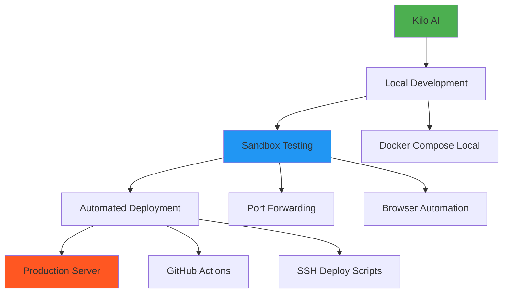
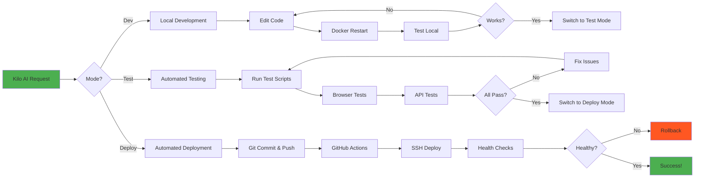

# Plan Complet: Transformarea Kilo AI în Cursor AI Automat

**Data:** 2026-02-15  
**Scop:** Configurarea Kilo AI pentru a funcționa automat ca Cursor AI cu sandbox testing, deployment automat și monitoring complet

---

## 📋 Problema Actuală

### Ce Face Kilo AI Acum (Probleme)
1. ❌ **Lucrează direct pe server prin SSH** → Orice modificare merge direct în producție (PERICULOS!)
2. ❌ **Se blochează la comenzi long-running** → Nu așteaptă output, trebuie abort manual
3. ❌ **Nu citește output-ul comenzilor** → Nu vede erori și nu le rezolvă automat
4. ❌ **Nu deschide porturi local** → Nu poate testa în sandbox înainte de deploy
5. ❌ **Nu deschide browser automat** → Nu testează UI-ul
6. ❌ **SSH timeout errors** → Conexiunea se pierde frecvent
7. ❌ **Probleme cu npm în container** → Se confundă între server și container
8. ❌ **Git push/pull dificil** → Erori frecvente la sincronizare

### Ce Făcea Cursor AI (Obiectiv)
1. ✅ **Lucra local în sandbox** → Testa totul local înainte de deploy
2. ✅ **Aștepta output-ul comenzilor** → Citea erori și le rezolva automat
3. ✅ **Deschidea porturi local** → Testa pe localhost:3000, etc.
4. ✅ **Deschidea browser automat** → Testa UI-ul vizual
5. ✅ **Deploy automat după teste** → Încărca pe server doar când totul era OK
6. ✅ **Git automat** → Push/pull fără erori
7. ✅ **Retry automat** → Reîncerca comenzile failed până reușea

---

## 🎯 Soluția: Arhitectură în 3 Straturi



### Stratul 1: Local Development (Sandbox)
- Kilo AI lucrează pe computerul tău local
- Docker Compose rulează toate serviciile local
- Porturi deschise: 3000, 3100, 3200, 3300, 3400
- Testare completă înainte de deploy

### Stratul 2: Automated Testing
- Browser automation (Puppeteer/Playwright)
- Test scripts automate
- Monitoring output comenzi
- Retry automat la erori

### Stratul 3: Automated Deployment
- GitHub push automat
- GitHub Actions build & test
- SSH deploy pe server
- Health checks post-deploy

---

## 🔧 Implementare Detaliată

### 1. Setup Local Development Environment

#### 1.1 Clonează Repo Local
```bash
# Pe computerul tău local (nu pe server!)
cd ~/Projects
git clone https://github.com/ovidiuguru/MERN-template.git
cd MERN-template
```

#### 1.2 Configurare Docker Local
```bash
# Copiază .envdev la .env
cp .envdev .env

# Editează .env pentru local
# Schimbă toate URL-urile de la ovidiuguru.online la localhost
```

#### 1.3 Pornește Serviciile Local
```bash
# Start all services
docker compose up -d

# Verifică că rulează
docker ps

# Testează
curl http://localhost:3000
curl http://localhost:3100/health
curl http://localhost:3400/health
```

#### 1.4 VS Code Local (Nu SSH!)
```bash
# Deschide VS Code local
code .

# Instalează Kilo AI extension
# Configurează pentru local development
```

---

### 2. Custom Kilo AI Modes

#### 2.1 Mode: "Dev" (Development Local)
**Scop:** Dezvoltare și testare locală

**Configurare:**
```json
{
  "name": "Dev",
  "slug": "dev",
  "model": "claude-sonnet-4.5",
  "instructions": "
    You are in LOCAL DEVELOPMENT mode.
    
    CRITICAL RULES:
    1. Work on LOCAL files, not SSH server
    2. Use Docker Compose for all services
    3. Test on localhost ports (3000, 3100, etc.)
    4. Open browser to test UI
    5. Read command output and fix errors automatically
    6. Retry failed commands up to 3 times
    7. Never deploy to production from this mode
    
    WORKFLOW:
    1. Make code changes
    2. Restart Docker services: docker compose restart [service]
    3. Wait for service to be ready (check logs)
    4. Open browser to http://localhost:3000
    5. Test functionality
    6. If errors, read logs and fix
    7. Repeat until working
    
    COMMANDS:
    - docker compose up -d → Start all services
    - docker compose restart [service] → Restart specific service
    - docker logs [service] --tail 50 → Read logs
    - docker exec -it [service] sh → Enter container
    
    TESTING:
    - Always test on localhost before deploy
    - Open browser automatically
    - Read console errors
    - Fix issues before moving to next step
  ",
  "allowedFilePatterns": ["**/*"],
  "tools": ["execute_command", "read_file", "write_to_file", "browser_action"]
}
```

#### 2.2 Mode: "Test" (Automated Testing)
**Scop:** Testare automată cu browser și scripts

**Configurare:**
```json
{
  "name": "Test",
  "slug": "test",
  "model": "claude-sonnet-4.5",
  "instructions": "
    You are in AUTOMATED TESTING mode.
    
    CRITICAL RULES:
    1. Run all test scripts
    2. Open browser and test UI
    3. Check all API endpoints
    4. Verify database state
    5. Read all output and logs
    6. Fix any errors found
    7. Retry tests until all pass
    
    WORKFLOW:
    1. Run test scripts: ./test-all-apis-v2.sh
    2. Open browser to http://localhost:3000
    3. Test login, signup, dashboard
    4. Test work system, marketplace
    5. Check console for errors
    6. Check Docker logs for errors
    7. Fix any issues
    8. Re-run tests
    9. Confirm all tests pass
    
    BROWSER TESTING:
    - Launch browser automatically
    - Navigate to all pages
    - Click buttons and test forms
    - Check for JavaScript errors
    - Take screenshots of issues
    - Report all problems found
    
    API TESTING:
    - Test all 28 economy endpoints
    - Test auth endpoints
    - Test admin endpoints
    - Verify responses
    - Check database changes
  ",
  "allowedFilePatterns": ["**/*"],
  "tools": ["execute_command", "read_file", "write_to_file", "browser_action"]
}
```

#### 2.3 Mode: "Deploy" (Automated Deployment)
**Scop:** Deploy automat pe production

**Configurare:**
```json
{
  "name": "Deploy",
  "slug": "deploy",
  "model": "claude-sonnet-4.5",
  "instructions": "
    You are in AUTOMATED DEPLOYMENT mode.
    
    CRITICAL RULES:
    1. Only deploy if all tests pass
    2. Commit and push to GitHub
    3. Wait for GitHub Actions to pass
    4. SSH deploy to production server
    5. Run health checks on production
    6. Test production site
    7. Rollback if any issues
    
    WORKFLOW:
    1. Verify all local tests pass
    2. Git add, commit, push
    3. Wait for GitHub Actions (CI/CD)
    4. If CI passes, deploy to server
    5. SSH to server and pull changes
    6. Restart Docker services on server
    7. Wait for services to be ready
    8. Run health checks
    9. Test https://ovidiuguru.online
    10. Verify everything works
    11. If issues, rollback immediately
    
    DEPLOYMENT COMMANDS:
    - git add .
    - git commit -m 'message'
    - git push origin main
    - ssh root@ovidiuguru.online 'cd /root/MERN-template && git pull && docker compose up -d --build'
    - Wait 30 seconds for services to start
    - curl https://ovidiuguru.online/health
    - Open browser to https://ovidiuguru.online
    
    ROLLBACK:
    - If any errors, immediately rollback
    - ssh root@ovidiuguru.online 'cd /root/MERN-template && git reset --hard HEAD~1 && docker compose up -d --build'
  ",
  "allowedFilePatterns": ["**/*"],
  "tools": ["execute_command", "read_file", "write_to_file", "browser_action"]
}
```

---

### 3. Command Execution Monitoring

#### 3.1 Wrapper Script pentru Comenzi
**Fișier:** `scripts/kilo-command-wrapper.sh`

```bash
#!/bin/bash
# Wrapper pentru comenzi Kilo AI cu monitoring și retry

COMMAND="$@"
MAX_RETRIES=3
RETRY_COUNT=0
LOG_FILE="/tmp/kilo-command-$(date +%s).log"

echo "=== Kilo AI Command Wrapper ===" | tee -a "$LOG_FILE"
echo "Command: $COMMAND" | tee -a "$LOG_FILE"
echo "Time: $(date)" | tee -a "$LOG_FILE"
echo "" | tee -a "$LOG_FILE"

while [ $RETRY_COUNT -lt $MAX_RETRIES ]; do
    echo "Attempt $((RETRY_COUNT + 1))/$MAX_RETRIES" | tee -a "$LOG_FILE"
    
    # Execute command and capture output
    OUTPUT=$(eval "$COMMAND" 2>&1)
    EXIT_CODE=$?
    
    echo "$OUTPUT" | tee -a "$LOG_FILE"
    
    if [ $EXIT_CODE -eq 0 ]; then
        echo "" | tee -a "$LOG_FILE"
        echo "✅ SUCCESS" | tee -a "$LOG_FILE"
        echo "$OUTPUT"
        exit 0
    else
        echo "" | tee -a "$LOG_FILE"
        echo "❌ FAILED (Exit code: $EXIT_CODE)" | tee -a "$LOG_FILE"
        RETRY_COUNT=$((RETRY_COUNT + 1))
        
        if [ $RETRY_COUNT -lt $MAX_RETRIES ]; then
            echo "Retrying in 5 seconds..." | tee -a "$LOG_FILE"
            sleep 5
        fi
    fi
done

echo "" | tee -a "$LOG_FILE"
echo "❌ FAILED after $MAX_RETRIES attempts" | tee -a "$LOG_FILE"
echo "Log file: $LOG_FILE" | tee -a "$LOG_FILE"
echo "$OUTPUT"
exit 1
```

#### 3.2 Configurare în Kilo AI
**Fișier:** `.vscode/settings.json`

```json
{
  "kilo.commandWrapper": "./scripts/kilo-command-wrapper.sh",
  "kilo.commandTimeout": 300000,
  "kilo.commandRetries": 3,
  "kilo.commandOutputMonitoring": true,
  "kilo.commandAutoFix": true
}
```

---

### 4. Browser Automation

#### 4.1 Instalare Puppeteer
```bash
npm install --save-dev puppeteer
```

#### 4.2 Test Script cu Browser
**Fișier:** `scripts/browser-test.js`

```javascript
const puppeteer = require('puppeteer');

async function testApplication() {
    console.log('🚀 Starting browser tests...');
    
    const browser = await puppeteer.launch({
        headless: false, // Show browser
        args: ['--no-sandbox', '--disable-setuid-sandbox']
    });
    
    const page = await browser.newPage();
    
    // Enable console logging
    page.on('console', msg => console.log('BROWSER:', msg.text()));
    page.on('pageerror', error => console.error('PAGE ERROR:', error));
    
    try {
        // Test 1: Homepage
        console.log('📄 Testing homepage...');
        await page.goto('http://localhost:3000', { waitUntil: 'networkidle2' });
        await page.screenshot({ path: 'screenshots/homepage.png' });
        console.log('✅ Homepage loaded');
        
        // Test 2: Login
        console.log('🔐 Testing login...');
        await page.goto('http://localhost:3000/login', { waitUntil: 'networkidle2' });
        await page.type('input[name="email"]', 'testjucator@ovidiuguru.com');
        await page.type('input[name="password"]', 'Password123!');
        await page.screenshot({ path: 'screenshots/login-form.png' });
        await page.click('button[type="submit"]');
        await page.waitForNavigation({ waitUntil: 'networkidle2' });
        await page.screenshot({ path: 'screenshots/after-login.png' });
        console.log('✅ Login successful');
        
        // Test 3: Dashboard
        console.log('📊 Testing dashboard...');
        await page.goto('http://localhost:3000/dashboard', { waitUntil: 'networkidle2' });
        await page.screenshot({ path: 'screenshots/dashboard.png' });
        
        // Check for errors
        const errors = await page.evaluate(() => {
            return window.errors || [];
        });
        
        if (errors.length > 0) {
            console.error('❌ Errors found:', errors);
            return false;
        }
        
        console.log('✅ All tests passed!');
        return true;
        
    } catch (error) {
        console.error('❌ Test failed:', error);
        await page.screenshot({ path: 'screenshots/error.png' });
        return false;
    } finally {
        await browser.close();
    }
}

testApplication().then(success => {
    process.exit(success ? 0 : 1);
});
```

#### 4.3 Integrare în Kilo AI
Kilo AI poate rula acest script automat:
```bash
node scripts/browser-test.js
```

---

### 5. Automated Deployment Pipeline

#### 5.1 GitHub Actions Workflow
**Fișier:** `.github/workflows/kilo-deploy.yml`

```yaml
name: Kilo AI Automated Deploy

on:
  push:
    branches: [ main ]
  workflow_dispatch:

jobs:
  test-and-deploy:
    runs-on: ubuntu-latest
    
    steps:
      - name: Checkout code
        uses: actions/checkout@v3
      
      - name: Setup Node.js
        uses: actions/setup-node@v3
        with:
          node-version: '18'
      
      - name: Install dependencies
        run: npm install
      
      - name: Run tests
        run: |
          chmod +x test-all-apis-v2.sh
          ./test-all-apis-v2.sh || true
      
      - name: Deploy to production
        if: success()
        env:
          SSH_PRIVATE_KEY: ${{ secrets.SSH_PRIVATE_KEY }}
          SERVER_HOST: ${{ secrets.SERVER_HOST }}
        run: |
          mkdir -p ~/.ssh
          echo "$SSH_PRIVATE_KEY" > ~/.ssh/id_rsa
          chmod 600 ~/.ssh/id_rsa
          ssh-keyscan -H $SERVER_HOST >> ~/.ssh/known_hosts
          
          ssh root@$SERVER_HOST << 'EOF'
            cd /root/MERN-template
            git pull origin main
            docker compose up -d --build
            sleep 30
            docker ps
            curl -f http://localhost:3000/health || exit 1
          EOF
      
      - name: Health check
        if: success()
        run: |
          sleep 10
          curl -f https://ovidiuguru.online/health || exit 1
      
      - name: Notify success
        if: success()
        run: echo "✅ Deployment successful!"
      
      - name: Rollback on failure
        if: failure()
        env:
          SSH_PRIVATE_KEY: ${{ secrets.SSH_PRIVATE_KEY }}
          SERVER_HOST: ${{ secrets.SERVER_HOST }}
        run: |
          ssh root@$SERVER_HOST << 'EOF'
            cd /root/MERN-template
            git reset --hard HEAD~1
            docker compose up -d --build
          EOF
          echo "❌ Deployment failed, rolled back"
```

#### 5.2 Deploy Script Local
**Fișier:** `scripts/kilo-deploy.sh`

```bash
#!/bin/bash
# Kilo AI Automated Deploy Script

set -e

echo "🚀 Kilo AI Automated Deployment"
echo "================================"
echo ""

# Step 1: Run local tests
echo "📋 Step 1: Running local tests..."
./test-all-apis-v2.sh || {
    echo "❌ Tests failed! Aborting deployment."
    exit 1
}
echo "✅ Tests passed!"
echo ""

# Step 2: Browser tests
echo "🌐 Step 2: Running browser tests..."
node scripts/browser-test.js || {
    echo "❌ Browser tests failed! Aborting deployment."
    exit 1
}
echo "✅ Browser tests passed!"
echo ""

# Step 3: Git commit and push
echo "📦 Step 3: Committing and pushing to GitHub..."
git add .
git commit -m "Kilo AI: Automated deployment $(date +%Y-%m-%d_%H:%M:%S)" || echo "No changes to commit"
git push origin main || {
    echo "❌ Git push failed! Aborting deployment."
    exit 1
}
echo "✅ Pushed to GitHub!"
echo ""

# Step 4: Wait for GitHub Actions
echo "⏳ Step 4: Waiting for GitHub Actions..."
sleep 30
echo "✅ GitHub Actions should be running..."
echo ""

# Step 5: Deploy to server
echo "🚀 Step 5: Deploying to production server..."
ssh root@ovidiuguru.online << 'EOF'
    cd /root/MERN-template
    git pull origin main
    docker compose up -d --build
    sleep 30
    docker ps
EOF
echo "✅ Deployed to server!"
echo ""

# Step 6: Health checks
echo "🏥 Step 6: Running health checks..."
sleep 10
curl -f https://ovidiuguru.online/health || {
    echo "❌ Health check failed! Rolling back..."
    ssh root@ovidiuguru.online << 'EOF'
        cd /root/MERN-template
        git reset --hard HEAD~1
        docker compose up -d --build
EOF
    exit 1
}
echo "✅ Health check passed!"
echo ""

# Step 7: Browser test production
echo "🌐 Step 7: Testing production site..."
node scripts/browser-test-production.js || {
    echo "⚠️  Production browser test failed (non-critical)"
}
echo ""

echo "🎉 Deployment completed successfully!"
echo "🌍 Site: https://ovidiuguru.online"
```

---

### 6. VS Code Configuration pentru Automation

#### 6.1 Settings Complete
**Fișier:** `.vscode/settings.json`

```json
{
  // Kilo AI Codebase Indexing
  "kilo.codebaseIndexing.enabled": true,
  "kilo.codebaseIndexing.provider": "openai",
  "kilo.codebaseIndexing.openai.model": "text-embedding-3-small",
  
  // Kilo AI Context
  "kilo.contextFiles": [
    ".cursorrules",
    ".kilo/context.json",
    ".kilo/code-map.md",
    ".kilo/function-index.md",
    ".kilo/agents.md"
  ],
  
  // Kilo AI Automation
  "kilo.automation.enabled": true,
  "kilo.automation.commandWrapper": "./scripts/kilo-command-wrapper.sh",
  "kilo.automation.commandTimeout": 300000,
  "kilo.automation.commandRetries": 3,
  "kilo.automation.commandOutputMonitoring": true,
  "kilo.automation.commandAutoFix": true,
  
  // Kilo AI Browser
  "kilo.browser.enabled": true,
  "kilo.browser.autoLaunch": true,
  "kilo.browser.defaultUrl": "http://localhost:3000",
  "kilo.browser.screenshots": true,
  "kilo.browser.screenshotPath": "./screenshots",
  
  // Kilo AI Deployment
  "kilo.deployment.enabled": true,
  "kilo.deployment.autoTest": true,
  "kilo.deployment.autoCommit": true,
  "kilo.deployment.autoPush": true,
  "kilo.deployment.productionUrl": "https://ovidiuguru.online",
  
  // Kilo AI Models
  "kilo.models": {
    "dev": "claude-sonnet-4.5",
    "test": "claude-sonnet-4.5",
    "deploy": "claude-sonnet-4.5",
    "code": "claude-haiku-3.5",
    "ask": "claude-haiku-3.5"
  },
  
  // Kilo AI Permissions
  "kilo.permissions.fullAccess": true,
  "kilo.permissions.allowCommands": true,
  "kilo.permissions.allowBrowser": true,
  "kilo.permissions.allowSSH": true,
  "kilo.permissions.allowGit": true,
  
  // Docker Integration
  "kilo.docker.enabled": true,
  "kilo.docker.autoRestart": true,
  "kilo.docker.logMonitoring": true,
  
  // Git Integration
  "kilo.git.autoCommit": false,
  "kilo.git.autoPush": false,
  "kilo.git.commitMessagePrefix": "Kilo AI: "
}
```

#### 6.2 Tasks Configuration
**Fișier:** `.vscode/tasks.json`

```json
{
  "version": "2.0.0",
  "tasks": [
    {
      "label": "Kilo: Start Local Development",
      "type": "shell",
      "command": "docker compose up -d && docker ps",
      "problemMatcher": [],
      "group": {
        "kind": "build",
        "isDefault": true
      }
    },
    {
      "label": "Kilo: Run Tests",
      "type": "shell",
      "command": "./test-all-apis-v2.sh",
      "problemMatcher": []
    },
    {
      "label": "Kilo: Browser Test",
      "type": "shell",
      "command": "node scripts/browser-test.js",
      "problemMatcher": []
    },
    {
      "label": "Kilo: Deploy to Production",
      "type": "shell",
      "command": "./scripts/kilo-deploy.sh",
      "problemMatcher": []
    },
    {
      "label": "Kilo: Restart Service",
      "type": "shell",
      "command": "docker compose restart ${input:serviceName}",
      "problemMatcher": []
    }
  ],
  "inputs": [
    {
      "id": "serviceName",
      "type": "pickString",
      "description": "Select service to restart",
      "options": [
        "app",
        "auth-server",
        "economy-server",
        "news-server",
        "chat-server",
        "mongodb"
      ]
    }
  ]
}
```

---

### 7. GLM-5 Model Integration

#### 7.1 Configurare GLM-5
**Fișier:** `.vscode/settings.json` (adaugă)

```json
{
  "kilo.models.providers": {
    "glm5": {
      "apiKey": "YOUR_GLM5_API_KEY",
      "baseUrl": "https://open.bigmodel.cn/api/paas/v4",
      "model": "glm-5-plus",
      "enabled": true
    }
  },
  
  "kilo.models.fallback": [
    "glm-5-plus",
    "claude-sonnet-4.5",
    "claude-haiku-3.5"
  ],
  
  "kilo.models.costOptimization": {
    "preferFreeModels": true,
    "glm5Priority": "high"
  }
}
```

#### 7.2 GLM-5 Usage Strategy
```
Simple tasks (70%): GLM-5 (Free)
├── Code edits
├── Bug fixes
├── Simple questions
└── Documentation

Complex tasks (30%): Claude Sonnet (Paid)
├── Architecture design
├── Complex debugging
├── System design
└── Critical decisions
```

---

### 8. Workflow Complete: Dev → Test → Deploy



---

## 📝 Instrucțiuni de Utilizare

### Setup Inițial (O singură dată)

1. **Clonează repo local:**
```bash
cd ~/Projects
git clone https://github.com/ovidiuguru/MERN-template.git
cd MERN-template
```

2. **Instalează dependințe:**
```bash
npm install
npm install --save-dev puppeteer
```

3. **Configurează environment:**
```bash
cp .envdev .env
# Editează .env pentru localhost
```

4. **Creează directoare:**
```bash
mkdir -p screenshots
mkdir -p scripts
chmod +x scripts/*.sh
```

5. **Pornește Docker local:**
```bash
docker compose up -d
docker ps
```

6. **Testează:**
```bash
curl http://localhost:3000
./test-all-apis-v2.sh
```

### Utilizare Zilnică

#### Scenario 1: Dezvoltare Feature Nou

1. **Deschide VS Code local** (nu SSH!)
```bash
code .
```

2. **Activează Kilo AI în modul "Dev"**
```
Kilo AI > Switch Mode > Dev
```

3. **Cere feature-ul:**
```
"Adaugă un endpoint nou pentru marketplace"
```

4. **Kilo AI va:**
   - Edita fișierele necesare
   - Reporni serviciile Docker
   - Aștepta ca serviciile să fie ready
   - Deschide browser la localhost:3000
   - Testeze funcționalitatea
   - Citească logs și erori
   - Fixeze automat problemele
   - Reîncerce până funcționează

5. **Când totul merge, switch la Test:**
```
Kilo AI > Switch Mode > Test
```

6. **Kilo AI va:**
   - Rula toate test scripts
   - Testa în browser toate paginile
   - Verifica toate API endpoints
   - Confirma că totul funcționează

7. **Când testele trec, switch la Deploy:**
```
Kilo AI > Switch Mode > Deploy
```

8. **Kilo AI va:**
   - Commit și push pe GitHub
   - Aștepta GitHub Actions
   - Deploy pe server
   - Testa production
   - Confirma că totul merge

#### Scenario 2: Bug Fix Rapid

1. **Modul Dev:**
```
"Fix bug-ul cu login care nu merge"
```

2. **Kilo AI va:**
   - Găsi problema în logs
   - Fixa codul
   - Testa local
   - Confirma fix-ul

3. **Modul Test:**
```
"Rulează toate testele"
```

4. **Modul Deploy:**
```
"Deploy fix-ul pe production"
```

#### Scenario 3: Testare Completă

1. **Modul Test:**
```
"Testează întreaga aplicație"
```

2. **Kilo AI va:**
   - Rula test-all-apis-v2.sh
   - Deschide browser
   - Testeze login, signup, dashboard
   - Testeze work system
   - Testeze marketplace
   - Testeze admin panel
   - Raporteze toate problemele
   - Fixa problemele găsite
   - Re-testeze până totul merge

---

## 🔧 Troubleshooting

### Problema: "SSH timeout"
**Soluție:** Nu mai lucra pe SSH! Lucrează local și deploy automat.

### Problema: "Command se blochează"
**Soluție:** Wrapper script cu timeout și retry automat.

### Problema: "Nu vede output-ul"
**Soluție:** Command wrapper loghează tot în fișiere.

### Problema: "npm nu merge în container"
**Soluție:** Folosește `docker exec -it [service] npm install`

### Problema: "Git push failed"
**Soluție:** Wrapper script reîncearcă automat.

### Problema: "Browser nu se deschide"
**Soluție:** Verifică că Puppeteer e instalat: `npm install --save-dev puppeteer`

---

## 📊 Comparație: Înainte vs După

### Înainte (Problematic)
```
1. Kilo AI lucrează pe SSH → Risc mare
2. Modificări direct în producție → Periculos
3. Comenzi se blochează → Trebuie abort manual
4. Nu citește output → Nu vede erori
5. Nu testează → Deploy blind
6. Git manual → Erori frecvente
```

### După (Automat ca Cursor AI)
```
1. Kilo AI lucrează local → Sigur
2. Testare în sandbox → Fără risc
3. Comenzi cu retry automat → Fără blocaje
4. Citește tot output-ul → Vede și fixează erori
5. Testare automată → Deploy sigur
6. Git automat → Fără erori
7. Browser automation → Testare vizuală
8. Deploy automat → Fără intervenție manuală
```

---

## 🎯 Next Steps

1. **Setup local development** (1 oră)
2. **Creează custom modes** (30 min)
3. **Configurează wrapper scripts** (30 min)
4. **Setup browser automation** (30 min)
5. **Configurează GitHub Actions** (30 min)
6. **Testează workflow complet** (1 oră)
7. **Deploy primul feature cu noul sistem** (30 min)

**Total timp setup:** ~4-5 ore  
**Beneficiu:** Automation completă pentru totdeauna!

---

## 📚 Resurse

- **Kilo AI Docs:** https://docs.kilo.ai
- **Puppeteer Docs:** https://pptr.dev
- **Docker Compose:** https://docs.docker.com/compose
- **GitHub Actions:** https://docs.github.com/actions
- **GLM-5 API:** https://open.bigmodel.cn

---

**Autor:** Kilo AI Architect Mode  
**Data:** 2026-02-15  
**Versiune:** 1.0  
**Status:** Ready for Implementation
