# 🎨 MODULE 2.3: VISUAL ARCHITECTURE DIAGRAMS

**Project:** PROJECT OMEGA - PBBG Economy Simulator  
**Module:** 2.3 - Visual System Architecture  
**Date:** 2026-02-14

---

## 📊 SYSTEM OVERVIEW

### Complete Economic Flow


---

## 🏗️ DATABASE ARCHITECTURE

### Entity Relationship Diagram

```mermaid
erDiagram
    User ||--o{ Inventory : owns
    User ||--o{ ConsumptionHistory : consumes
    User ||--o{ Ledger : participates
    User }o--|| Company : works_at
    
    Company ||--o{ Inventory : owns
    Company ||--o{ MarketplaceListing : sells
    Company ||--o{ User : employs
    
    ItemPrototype ||--o{ Inventory : defines
    ItemPrototype ||--o{ MarketplaceListing : describes
    
    Inventory ||--o| MarketplaceListing : listed_as
    
    Treasury ||--o{ Ledger : receives_tax
    
    User {
        ObjectId _id PK
        String username
        String email
        Decimal128 balance_euro
        Decimal128 balance_gold
        Number energy
        Number happiness
        ObjectId current_company_id FK
        Date work_cooldown_until
        Boolean is_frozen_for_fraud
    }
    
    Company {
        ObjectId _id PK
        String name
        Decimal128 funds_euro
        Decimal128 wage_offer
        Number employee_count
        Number max_employees
        ObjectId owner_id FK
    }
    
    ItemPrototype {
        ObjectId _id PK
        String item_code UK
        String name
        String category
        String rarity
        Object base_effects
        Decimal128 base_price_euro
        Boolean is_tradeable
        Boolean is_consumable
        Number consumption_cooldown_seconds
    }
    
    Inventory {
        ObjectId _id PK
        ObjectId owner_id FK
        String owner_type
        String item_code FK
        Number quality
        Decimal128 quantity
        Boolean is_listed
        Decimal128 listing_price_euro
        Date acquired_at
        Date expires_at
    }
    
    MarketplaceListing {
        ObjectId _id PK
        ObjectId seller_id FK
        String seller_type
        ObjectId inventory_id FK
        String item_code
        Number quality
        Decimal128 quantity
        Decimal128 price_per_unit_euro
        Date listed_at
        Date expires_at
    }
    
    ConsumptionHistory {
        ObjectId _id PK
        ObjectId user_id FK
        String item_code
        Number quality
        Decimal128 quantity_consumed
        Object effects_applied
        Object state_before
        Object state_after
        Date consumed_at
    }
    
    Treasury {
        ObjectId _id PK
        Decimal128 collected_work_tax_euro
        Decimal128 collected_market_tax_euro
        Decimal128 collected_transfer_tax_euro
        Decimal128 total_collected
        Boolean singleton
    }
    
    Ledger {
        ObjectId _id PK
        String type
        ObjectId from_user FK
        ObjectId to_user FK
        Decimal128 amount_euro
        Decimal128 tax_euro
        Decimal128 net_amount_euro
        String description
        Object metadata
        Date created_at
    }
```



---

## 🔄 TRANSACTION FLOWS

### Marketplace Purchase Flow


### Consumption Flow

```mermaid
sequenceDiagram
    participant Player
    participant API
    participant DB
    participant ItemPrototype
    participant Inventory
    
    Player->>API: POST /consume
    API->>DB: Check Cooldown
    DB-->>API: Cooldown OK
    
    API->>Inventory: Find Item
    Inventory-->>API: Item Found (Q3 Bread)
    
    API->>ItemPrototype: Get Base Effects
    ItemPrototype-->>API: Energy: +5
    
    API->>API: Calculate Quality Multiplier
    Note over API: Q3 = 3.5x → +18 Energy
    
    API->>DB: Start Transaction
    
    API->>DB: Reduce Inventory
    Note over DB: Quantity: 5 → 4
    
    API->>DB: Update Player Stats
    Note over DB: Energy: 65 → 83 (capped at 100)
    
    API->>DB: Set Cooldown
    Note over DB: Cooldown: 5 minutes
    
    API->>DB: Create History Entry
    
    API->>DB: Commit Transaction
    DB-->>API: Success
    
    API-->>Player: Consumption Complete
```



### Work + Item Reward Flow

```mermaid
sequenceDiagram
    participant Player
    participant API
    participant WorkService
    participant Company
    participant Treasury
    participant Inventory
    
    Player->>API: POST /work
    API->>WorkService: Process Work
    
    WorkService->>Company: Check Funds
    Company-->>WorkService: Funds OK
    
    WorkService->>WorkService: Calculate Salary
    Note over WorkService: Gross: €10.00<br/>Tax: €1.50<br/>Net: €8.50
    
    WorkService->>Company: Deduct Salary
    Note over Company: Funds: €100 → €90
    
    WorkService->>Player: Add Net Salary
    Note over Player: Balance: €0 → €8.50
    
    WorkService->>Treasury: Collect Tax
    Note over Treasury: +€1.50
    
    WorkService->>Inventory: Grant Bonus Items
    Note over Inventory: +1 Q1 Bread
    
    WorkService->>Player: Deduct Energy
    Note over Player: Energy: 100 → 90
    
    WorkService->>Player: Set Cooldown
    Note over Player: Cooldown: 24 hours
    
    WorkService-->>API: Work Complete
    API-->>Player: Success + Items
```



---

## 🎮 USER JOURNEY FLOWS

### New Player Journey

```mermaid
graph TD
    A[New Player Joins] -->|Initial State| B[Energy: 100<br/>Balance: €0<br/>Inventory: Empty]
    B --> C[Works at Company]
    C --> D[Receives €8.50 + 1 Q1 Bread]
    D --> E[Energy: 90/100]
    E --> F{Wait 24h}
    F -->|Time Passes| G[Energy Decays to 65]
    G --> H[Eats Q1 Bread]
    H --> I[Energy: 70/100]
    I --> J[Works Again]
    J --> K[Receives €8.50 + 1 Q1 Bread]
    K --> L{Has €17.00}
    L --> M[Buys 2 Q1 Bread from Market]
    M --> N[Spends €2.20]
    N --> O[Balance: €14.80<br/>Inventory: 3 Breads]
    O --> P[Sustainable Loop Established]
    
    style A fill:#e1f5ff
    style P fill:#d4edda
```



### Daily Player Loop

```mermaid
graph LR
    A[Morning: Energy 65] --> B[Eat Bread +5]
    B --> C[Energy 70]
    C --> D[Work -10]
    D --> E[Earn €8.50 + Bread]
    E --> F[Energy 60]
    F --> G[Evening: Decay -5]
    G --> H[Energy 55]
    H --> I[Eat Bread +5]
    I --> J[Energy 60]
    J --> K[Night: Decay -10]
    K --> A
    
    style A fill:#fff3cd
    style E fill:#d4edda
```



---

## 🏪 MARKETPLACE ARCHITECTURE

### Listing Lifecycle


### Price Calculation Flow

```mermaid
graph TD
    A[Base Price: €1.00] --> B{Quality Tier?}
    B -->|Q1| C[€1.00 × 1.0 = €1.00]
    B -->|Q2| D[€1.00 × 2.5 = €2.50]
    B -->|Q3| E[€1.00 × 5.0 = €5.00]
    B -->|Q4| F[€1.00 × 10.0 = €10.00]
    B -->|Q5| G[€1.00 × 25.0 = €25.00]
    
    C --> H[Add VAT 10%]
    D --> H
    E --> H
    F --> H
    G --> H
    
    H --> I[Final Prices]
    I --> J[Q1: €1.10]
    I --> K[Q2: €2.75]
    I --> L[Q3: €5.50]
    I --> M[Q4: €11.00]
    I --> N[Q5: €27.50]
    
    style I fill:#d4edda
```



---

## ⚙️ SYSTEM INTEGRATION

### Module Dependencies


### API Endpoint Map

```mermaid
graph LR
    subgraph "Client"
        UI[React Frontend]
    end
    
    subgraph "API Gateway Port 3000"
        GW[NGINX Proxy]
    end
    
    subgraph "Economy Server Port 3400"
        E1[/inventory]
        E2[/marketplace]
        E3[/consume]
        E4[/work]
        E5[/balance]
    end
    
    subgraph "Auth Server Port 3100"
        A1[/login]
        A2[/signup]
    end
    
    UI --> GW
    GW --> E1
    GW --> E2
    GW --> E3
    GW --> E4
    GW --> E5
    GW --> A1
    GW --> A2
    
    E1 --> DB[(MongoDB)]
    E2 --> DB
    E3 --> DB
    E4 --> DB
    E5 --> DB
    A1 --> DB
    A2 --> DB
```

---

## 📊 DATA FLOW DIAGRAMS

### Item Quality Scaling

```mermaid
graph TD
    A[ItemPrototype<br/>Base Effects] --> B{Quality Multiplier}
    
    B -->|Q1: 1.0x| C1[Energy: +5<br/>Price: €1.00]
    B -->|Q2: 2.0x| C2[Energy: +10<br/>Price: €2.50]
    B -->|Q3: 3.5x| C3[Energy: +18<br/>Price: €5.00]
    B -->|Q4: 5.5x| C4[Energy: +28<br/>Price: €10.00]
    B -->|Q5: 10.0x| C5[Energy: +50<br/>Price: €25.00]
    
    C1 --> D[Inventory Item]
    C2 --> D
    C3 --> D
    C4 --> D
    C5 --> D
    
    D --> E[Player Consumes]
    E --> F[Energy Restored]
    
    style A fill:#e1f5ff
    style D fill:#fff3cd
    style F fill:#d4edda
```



### Money Flow Tracking

```mermaid
graph TD
    A[Company Treasury<br/>€1000] -->|Salary €10| B[Player Wallet<br/>€0]
    B -->|Tax €1.50| C[Government Treasury<br/>€0]
    B -->|Net €8.50| D[Player Balance<br/>€8.50]
    
    D -->|Purchase €1.10| E[Marketplace]
    E -->|Net €1.00| F[Seller Company<br/>€1000]
    E -->|VAT €0.10| C
    
    F -->|Salary €10| G[Another Player]
    
    C -->|Total Collected| H[€1.60 Tax Revenue]
    
    style A fill:#fff3cd
    style C fill:#d4edda
    style H fill:#d4edda
```



---

## 🔒 SECURITY LAYERS

### Anti-Fraud Architecture


---

## 📱 FRONTEND COMPONENT HIERARCHY

### Dashboard Structure


---

## 🎯 IMPLEMENTATION PHASES

### Phase Timeline


---

## 📈 SUCCESS METRICS DASHBOARD

### Key Performance Indicators

```mermaid
graph LR
    subgraph "Technical KPIs"
        T1[API Response Time<br/>Target: <200ms]
        T2[Transaction Success<br/>Target: 100%]
        T3[Uptime<br/>Target: 99.9%]
    end
    
    subgraph "Economic KPIs"
        E1[Player Profit<br/>Target: +€5-10/day]
        E2[Treasury Growth<br/>Target: +€2-5/day]
        E3[Market Volume<br/>Target: €100+/day]
    end
    
    subgraph "User KPIs"
        U1[Session Time<br/>Target: 15+ min]
        U2[Daily Active<br/>Target: 50%+]
        U3[Retention<br/>Target: 60%+ at 7d]
    end
    
    T1 --> M[Monitoring<br/>Dashboard]
    T2 --> M
    T3 --> M
    E1 --> M
    E2 --> M
    E3 --> M
    U1 --> M
    U2 --> M
    U3 --> M
    
    M --> A[Alerts &<br/>Reports]
    
    style M fill:#d4edda
    style A fill:#fff3cd
```



---

## 🔄 CONTINUOUS IMPROVEMENT CYCLE


---

**Document Version:** 1.0.0  
**Last Updated:** 2026-02-14  
**Purpose:** Visual reference for Module 2.3 architecture  
**Next Action:** Use these diagrams during implementation
