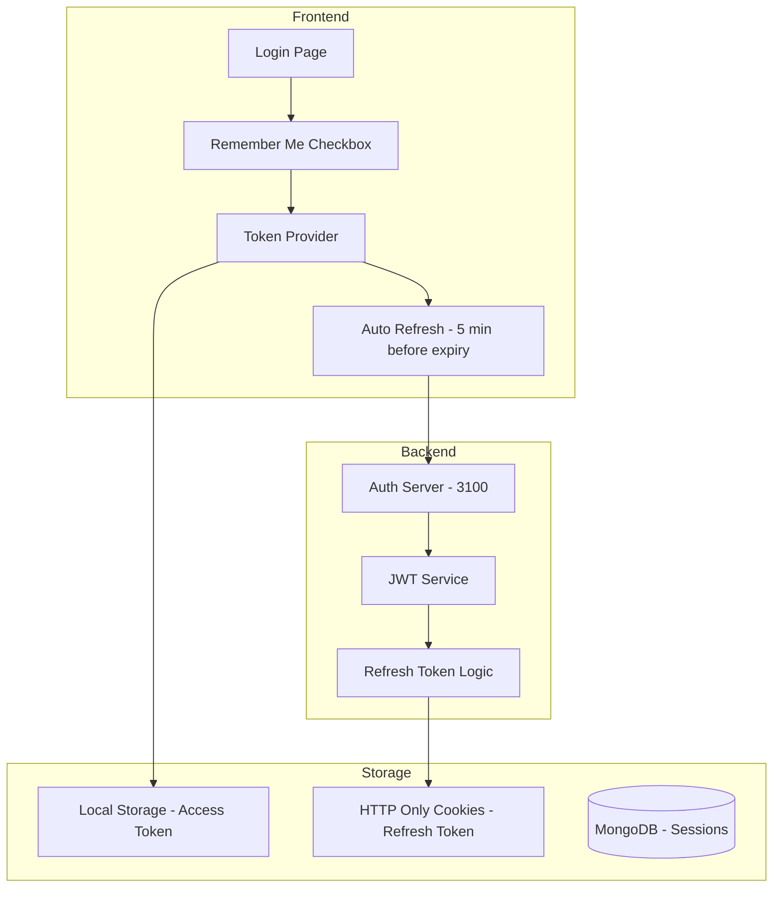

# Plan Complex: Fixare Sesiuni și Decimal128

**Data:** 2026-02-21  
**Status:** În implementare  
**Prioritate:** CRITICĂ

---

## 📋 Sumar Probleme

### Problema 1: Sesiune Expirată și Logout Blocat

- **Simptom:** "Your session has expired. Please log in again" apare frecvent
- **Cauză:** Token JWT expiră după 1 oră, refresh token nu funcționează corect
- **Impact:** Utilizatorul nu se poate deloga, butonul logout nu funcționează

### Problema 2: Eroare React $numberDecimal

- **Simptom:** `Objects are not valid as a React child (found: object with keys {$numberDecimal})`
- **Cauză:** MongoDB Decimal128 nu poate fi randat direct în React
- **Impact:** Login din incognito eșuează, aplicația crapă

### Problema 3: Configurație Sandbox vs Production

- **Simptom:** Credențiale MongoDB Atlas în .env.sandbox nu trebuie să ajungă în production
- **Cauză:** Lipsa separării clare între environment-uri
- **Impact:** Risc de securitate, deploy incorect

---

## 🔧 Soluție Detaliată

### SOLUȚIA 1: Sistem de Sesiuni Persistente

#### 1.1 Modificări în `auth.js` (Backend)

```javascript
// Modificare generateTokens pentru a suporta rememberMe
const generateTokens = (user, rememberMe = false) => {
	const payload = {
		id: user._id,
		username: user.username,
		email: user.email,
		role: user.role,
		admin: user.role === 'admin',
		mod: user.role === 'moderator' || user.role === 'admin',
	};

	// Dacă rememberMe e true, token-ul durează 30 de zile
	const accessExpiry = rememberMe ? '30d' : '1h';
	const refreshExpiry = rememberMe ? '90d' : '7d';

	const accessToken = jwt.sign(payload, SECRET_ACCESS, {
		expiresIn: accessExpiry,
	});
	const refreshToken = jwt.sign({ id: user._id, rememberMe }, SECRET_REFRESH, {
		expiresIn: refreshExpiry,
	});

	return { accessToken, refreshToken };
};

// POST /login - adaugă suport pentru rememberMe
router.post('/login', async (req, res) => {
	const { email, password, rememberMe } = req.body;
	// ... validare ...

	const { accessToken, refreshToken } = generateTokens(user, rememberMe);

	// Setează cookie pentru refresh token dacă rememberMe
	if (rememberMe) {
		res.cookie('refreshToken', refreshToken, {
			httpOnly: true,
			secure: process.env.NODE_ENV === 'production',
			maxAge: 90 * 24 * 60 * 60 * 1000, // 90 zile
			sameSite: 'strict',
		});
	}

	res.json({ accessToken, refreshToken, user: userPayload });
});
```

#### 1.2 Modificări în `token-provider.jsx` (Frontend)

```javascript
// Adaugă verificare automată și refresh înainte de expirare
const TokenProvider = (props) => {
	const [accessToken, setAccessToken] = useState('');
	const [rememberMe, setRememberMe] = useState(false);

	// Auto-refresh cu 5 minute înainte de expirare
	useEffect(() => {
		if (!accessToken) return;

		const checkAndRefresh = async () => {
			try {
				const decoded = jwtDecode(accessToken);
				const expiresAt = decoded.exp * 1000;
				const now = Date.now();
				const fiveMinutes = 5 * 60 * 1000;

				if (expiresAt - now < fiveMinutes) {
					await refreshToken();
				}
			} catch (error) {
				console.error('Token check failed:', error);
			}
		};

		// Verifică la fiecare minut
		const interval = setInterval(checkAndRefresh, 60000);
		return () => clearInterval(interval);
	}, [accessToken]);

	// Logout funcțional
	const logout = async () => {
		try {
			await fetch(`${config.AUTH_URI}/auth/logout`, {
				method: 'POST',
				credentials: 'include',
			});
		} catch (error) {
			console.error('Logout error:', error);
		}

		localStorage.removeItem('accessToken');
		localStorage.removeItem('refreshToken');
		setAccessToken('');
		window.location.href = '/login';
	};

	// ... restul codului
};
```

#### 1.3 Modificări în `login.jsx` - Adaugă Remember Me

```jsx
// Adaugă checkbox pentru Remember Me
const [rememberMe, setRememberMe] = useState(false);

// În formular:
<div style={styles.checkboxGroup}>
    <input
        type='checkbox'
        id='rememberMe'
        checked={rememberMe}
        onChange={(e) => setRememberMe(e.target.checked)}
    />
    <label htmlFor='rememberMe' style={styles.checkboxLabel}>
        🔒 Remember me for 30 days
    </label>
</div>

// În handleSubmit:
body: JSON.stringify({
    email,
    password,
    rememberMe
}),
```

---

### SOLUȚIA 2: Conversie Decimal128

#### 2.1 Creează utilitar `decimal-utils.js`

```javascript
// client/utilities/decimal-utils.js

/**
 * Convertește un obiect Decimal128 MongoDB la number
 * @param {Object} value - Valoare care poate fi Decimal128, string, sau number
 * @returns {number} - Valoarea numerică
 */
export const toNumber = (value) => {
	if (value === null || value === undefined) return 0;

	// Dacă e obiect cu $numberDecimal (din JSON)
	if (typeof value === 'object' && value.$numberDecimal !== undefined) {
		return parseFloat(value.$numberDecimal);
	}

	// Dacă e string
	if (typeof value === 'string') {
		return parseFloat(value) || 0;
	}

	// Dacă e deja number
	if (typeof value === 'number') {
		return value;
	}

	// Dacă e obiect Decimal128 (din MongoDB direct)
	if (value.toString && typeof value.toString === 'function') {
		return parseFloat(value.toString());
	}

	return 0;
};

/**
 * Formatează un număr ca valută
 * @param {number} value - Valoarea numerică
 * @param {string} currency - Codul monedei (EUR, RON, GOLD)
 * @returns {string} - Valoare formatată
 */
export const formatCurrency = (value, currency = 'EUR') => {
	const num = toNumber(value);
	return new Intl.NumberFormat('ro-RO', {
		style: 'currency',
		currency: currency === 'GOLD' ? 'EUR' : currency,
		minimumFractionDigits: 2,
		maximumFractionDigits: 4,
	}).format(num);
};

/**
 * Convertește recursiv toate câmpurile Decimal128 dintr-un obiect
 * @param {Object} obj - Obiectul de convertit
 * @returns {Object} - Obiectul cu valorile convertite
 */
export const convertDecimals = (obj) => {
	if (obj === null || obj === undefined) return obj;

	if (Array.isArray(obj)) {
		return obj.map(convertDecimals);
	}

	if (typeof obj === 'object') {
		// Verifică dacă e un $numberDecimal
		if (obj.$numberDecimal !== undefined) {
			return toNumber(obj);
		}

		// Convertește recursiv
		const result = {};
		for (const key in obj) {
			result[key] = convertDecimals(obj[key]);
		}
		return result;
	}

	return obj;
};
```

#### 2.2 Modifică API responses pentru a converti automat

```javascript
// Middleware în server pentru a converti Decimal128
const convertDecimalMiddleware = (req, res, next) => {
	const originalJson = res.json.bind(res);

	res.json = (data) => {
		const converted = convertDecimals(data);
		return originalJson(converted);
	};

	next();
};

// Aplică în server.js
app.use(convertDecimalMiddleware);
```

#### 2.3 Modifică componente React pentru a folosi utilitarul

```jsx
// În WorkStation.jsx
import { toNumber, formatCurrency } from '../utilities/decimal-utils';

// În loc de:
<span>{user.balance_euro}</span>

// Folosește:
<span>{formatCurrency(user.balance_euro, 'EUR')}</span>
```

---

### SOLUȚIA 3: Environment Detection

#### 3.1 Creează `config/environment.js`

```javascript
// config/environment.js

const detectEnvironment = () => {
	// Verifică dacă suntem în Codespaces
	if (
		process.env.GITHUB_CODESPACES === 'true' ||
		window.location.hostname.includes('github.dev')
	) {
		return 'sandbox';
	}

	// Verifică dacă suntem în development local
	if (
		window.location.hostname === 'localhost' ||
		window.location.hostname === '127.0.0.1'
	) {
		return 'development';
	}

	// Altfel, production
	return 'production';
};

export const ENV = detectEnvironment();

export const isSandbox = ENV === 'sandbox';
export const isDevelopment = ENV === 'development';
export const isProduction = ENV === 'production';

// Configurații specifice
export const config = {
	sandbox: {
		MONGODB_URI: process.env.DB_URI_SANDBOX,
		SESSION_SECRET: 'sandbox-secret',
		TOKEN_EXPIRY: '30d',
	},
	development: {
		MONGODB_URI: 'mongodb://localhost:27017/game_db',
		SESSION_SECRET: 'dev-secret',
		TOKEN_EXPIRY: '1h',
	},
	production: {
		MONGODB_URI: process.env.DB_URI,
		SESSION_SECRET: process.env.SESSION_SECRET,
		TOKEN_EXPIRY: '1h',
	},
};

export const getConfig = () => config[ENV];
```

#### 3.2 Actualizează `.gitignore`

```gitignore
# Environment files with secrets
.env.sandbox
.env.production.local

# Keep templates
!.env.sandbox.example
!.env.production
```

#### 3.3 Creează scripturi separate

```json
// package.json
{
	"scripts": {
		"start:sandbox": "NODE_ENV=sandbox node server/index.js",
		"start:production": "NODE_ENV=production node server/index.js",
		"deploy:production": "docker compose -f docker-compose.production.yml up -d"
	}
}
```

---

## 📊 Diagramă Arhitectură



---

## ✅ Checklist Implementare

### Faza 1: Sesiuni (Prioritate: CRITICĂ)

- [ ] Modifică `auth.js` pentru rememberMe
- [ ] Actualizează `token-provider.jsx` cu auto-refresh
- [ ] Adaugă checkbox Remember Me în `login.jsx`
- [ ] Implementează logout funcțional
- [ ] Testează sesiune persistentă

### Faza 2: Decimal128 (Prioritate: ÎNALTĂ)

- [ ] Creează `decimal-utils.js`
- [ ] Adaugă middleware de conversie
- [ ] Actualizează WorkStation.jsx
- [ ] Actualizează InventoryPanel.jsx
- [ ] Actualizează MarketplacePanel.jsx
- [ ] Testează în incognito

### Faza 3: Environment (Prioritate: MEDIU)

- [ ] Creează `environment.js`
- [ ] Actualizează `.gitignore`
- [ ] Separă scripturi npm
- [ ] Documentează procedura

### Faza 4: Testare (Prioritate: CRITICĂ)

- [ ] Instalează Playwright
- [ ] Scrie teste pentru login
- [ ] Scrie teste pentru sesiuni
- [ ] Scrie teste pentru Decimal128
- [ ] CI/CD integration

---

## 🚀 Execuție

Acest plan va fi implementat în modul **Code** pentru modificările de cod și **Debug** pentru testare.

**Următorul pas:** Trecere la modul Code pentru implementare.
