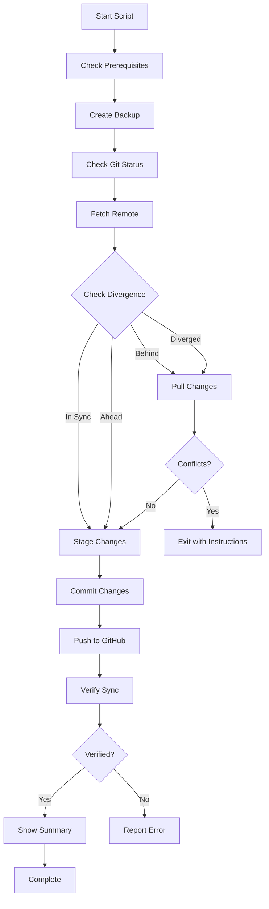

# 🤖 GitHub Sync Automation Script

**File:** `scripts/sync-with-github.sh`  
**Purpose:** Automated synchronization between server and GitHub  
**Status:** Ready for implementation

---

## 📋 Script Content

Save this as `scripts/sync-with-github.sh`:

```bash
#!/bin/bash

################################################################################
# GitHub Synchronization Script
# 
# Purpose: Synchronize server state with GitHub repository
# Ensures: Server and GitHub are identical
# 
# Usage: bash scripts/sync-with-github.sh [options]
# Options:
#   --force       Force push (use with caution)
#   --dry-run     Show what would be done without doing it
#   --auto        Run without prompts (for automation)
################################################################################

set -e  # Exit on error

# Colors for output
RED='\033[0;31m'
GREEN='\033[0;32m'
YELLOW='\033[1;33m'
BLUE='\033[0;34m'
NC='\033[0m' # No Color

# Configuration
REPO_DIR="/root/MERN-template"
BRANCH="main"
REMOTE="origin"
LOG_FILE="/var/log/github-sync.log"
BACKUP_DIR="/root/backups/git-sync"

# Parse arguments
FORCE_PUSH=false
DRY_RUN=false
AUTO_MODE=false

for arg in "$@"; do
    case $arg in
        --force)
            FORCE_PUSH=true
            shift
            ;;
        --dry-run)
            DRY_RUN=true
            shift
            ;;
        --auto)
            AUTO_MODE=true
            shift
            ;;
    esac
done

################################################################################
# Helper Functions
################################################################################

log() {
    local level=$1
    shift
    local message="$@"
    local timestamp=$(date '+%Y-%m-%d %H:%M:%S')
    echo -e "${timestamp} [${level}] ${message}" | tee -a "$LOG_FILE"
}

info() {
    echo -e "${BLUE}ℹ${NC} $@"
    log "INFO" "$@"
}

success() {
    echo -e "${GREEN}✓${NC} $@"
    log "SUCCESS" "$@"
}

warning() {
    echo -e "${YELLOW}⚠${NC} $@"
    log "WARNING" "$@"
}

error() {
    echo -e "${RED}✗${NC} $@"
    log "ERROR" "$@"
}

prompt_continue() {
    if [ "$AUTO_MODE" = true ]; then
        return 0
    fi
    
    read -p "Continue? (y/n) " -n 1 -r
    echo
    if [[ ! $REPLY =~ ^[Yy]$ ]]; then
        error "Operation cancelled by user"
        exit 1
    fi
}

################################################################################
# Main Functions
################################################################################

check_prerequisites() {
    info "Checking prerequisites..."
    
    # Check if we're in a git repository
    if [ ! -d "$REPO_DIR/.git" ]; then
        error "Not a git repository: $REPO_DIR"
        exit 1
    fi
    
    # Check if git is installed
    if ! command -v git &> /dev/null; then
        error "Git is not installed"
        exit 1
    fi
    
    # Change to repo directory
    cd "$REPO_DIR" || exit 1
    
    success "Prerequisites check passed"
}

create_backup() {
    info "Creating backup..."
    
    local backup_name="git-backup-$(date +%Y%m%d-%H%M%S)"
    mkdir -p "$BACKUP_DIR"
    
    # Create a bundle of current state
    git bundle create "$BACKUP_DIR/$backup_name.bundle" --all
    
    # Save current branch and commit
    git rev-parse HEAD > "$BACKUP_DIR/$backup_name.commit"
    git branch --show-current > "$BACKUP_DIR/$backup_name.branch"
    
    success "Backup created: $BACKUP_DIR/$backup_name.bundle"
}

check_git_status() {
    info "Checking Git status..."
    
    # Get current branch
    local current_branch=$(git branch --show-current)
    info "Current branch: $current_branch"
    
    # Check for uncommitted changes
    if ! git diff-index --quiet HEAD --; then
        warning "You have uncommitted changes:"
        git status --short
        echo
        prompt_continue
    else
        success "Working tree is clean"
    fi
    
    # Check for untracked files
    local untracked=$(git ls-files --others --exclude-standard)
    if [ -n "$untracked" ]; then
        warning "You have untracked files:"
        echo "$untracked"
        echo
        prompt_continue
    fi
}

fetch_remote() {
    info "Fetching from remote..."
    
    if [ "$DRY_RUN" = true ]; then
        info "[DRY RUN] Would fetch from $REMOTE"
        return 0
    fi
    
    git fetch "$REMOTE" --prune
    success "Fetched from $REMOTE"
}

check_divergence() {
    info "Checking for divergence..."
    
    local local_commit=$(git rev-parse HEAD)
    local remote_commit=$(git rev-parse "$REMOTE/$BRANCH")
    
    if [ "$local_commit" = "$remote_commit" ]; then
        success "Local and remote are in sync"
        return 0
    fi
    
    # Check if local is behind
    if git merge-base --is-ancestor HEAD "$REMOTE/$BRANCH"; then
        warning "Local is behind remote"
        return 1
    fi
    
    # Check if local is ahead
    if git merge-base --is-ancestor "$REMOTE/$BRANCH" HEAD; then
        info "Local is ahead of remote"
        return 2
    fi
    
    # Branches have diverged
    warning "Local and remote have diverged"
    return 3
}

pull_changes() {
    info "Pulling changes from GitHub..."
    
    if [ "$DRY_RUN" = true ]; then
        info "[DRY RUN] Would pull from $REMOTE/$BRANCH"
        git diff HEAD.."$REMOTE/$BRANCH" --stat
        return 0
    fi
    
    # Try to pull with rebase
    if git pull "$REMOTE" "$BRANCH" --rebase; then
        success "Successfully pulled and rebased"
    else
        error "Pull failed. You may have conflicts to resolve."
        info "To resolve conflicts:"
        info "  1. Fix conflicts in the files"
        info "  2. git add <resolved-files>"
        info "  3. git rebase --continue"
        info "  4. Run this script again"
        exit 1
    fi
}

stage_changes() {
    info "Staging all changes..."
    
    if [ "$DRY_RUN" = true ]; then
        info "[DRY RUN] Would stage all changes"
        git status --short
        return 0
    fi
    
    # Add all changes
    git add -A
    
    # Show what was staged
    if git diff --cached --quiet; then
        info "No changes to stage"
    else
        success "Staged changes:"
        git diff --cached --stat
    fi
}

commit_changes() {
    info "Committing changes..."
    
    # Check if there are changes to commit
    if git diff --cached --quiet; then
        info "No changes to commit"
        return 0
    fi
    
    if [ "$DRY_RUN" = true ]; then
        info "[DRY RUN] Would commit changes"
        return 0
    fi
    
    # Create commit message
    local commit_msg="chore: sync server state with GitHub

- Automated sync from production server
- Date: $(date '+%Y-%m-%d %H:%M:%S')
- Host: $(hostname)

Changes include:
$(git diff --cached --stat | tail -n 1)"
    
    git commit -m "$commit_msg"
    success "Changes committed"
}

push_changes() {
    info "Pushing changes to GitHub..."
    
    if [ "$DRY_RUN" = true ]; then
        info "[DRY RUN] Would push to $REMOTE/$BRANCH"
        return 0
    fi
    
    if [ "$FORCE_PUSH" = true ]; then
        warning "Force pushing to $REMOTE/$BRANCH"
        prompt_continue
        git push "$REMOTE" "$BRANCH" --force-with-lease
    else
        git push "$REMOTE" "$BRANCH"
    fi
    
    success "Successfully pushed to GitHub"
}

verify_sync() {
    info "Verifying synchronization..."
    
    # Fetch latest
    git fetch "$REMOTE" --quiet
    
    local local_commit=$(git rev-parse HEAD)
    local remote_commit=$(git rev-parse "$REMOTE/$BRANCH")
    
    if [ "$local_commit" = "$remote_commit" ]; then
        success "✓ Server and GitHub are synchronized!"
        success "✓ Commit: $local_commit"
        return 0
    else
        error "✗ Synchronization verification failed"
        error "Local:  $local_commit"
        error "Remote: $remote_commit"
        return 1
    fi
}

show_summary() {
    echo
    echo "═══════════════════════════════════════════════════════════"
    echo "                    SYNC SUMMARY"
    echo "═══════════════════════════════════════════════════════════"
    echo
    echo "Repository: $(git remote get-url $REMOTE)"
    echo "Branch:     $BRANCH"
    echo "Commit:     $(git rev-parse --short HEAD)"
    echo "Date:       $(date '+%Y-%m-%d %H:%M:%S')"
    echo
    echo "Recent commits:"
    git log --oneline -5
    echo
    echo "═══════════════════════════════════════════════════════════"
}

################################################################################
# Main Execution
################################################################################

main() {
    echo
    echo "═══════════════════════════════════════════════════════════"
    echo "           GitHub Synchronization Script"
    echo "═══════════════════════════════════════════════════════════"
    echo
    
    # Create log directory if it doesn't exist
    mkdir -p "$(dirname "$LOG_FILE")"
    
    log "INFO" "Starting GitHub synchronization"
    
    # Step 1: Prerequisites
    check_prerequisites
    
    # Step 2: Create backup
    create_backup
    
    # Step 3: Check current status
    check_git_status
    
    # Step 4: Fetch from remote
    fetch_remote
    
    # Step 5: Check divergence
    check_divergence
    divergence_status=$?
    
    # Step 6: Pull if needed
    if [ $divergence_status -eq 1 ] || [ $divergence_status -eq 3 ]; then
        pull_changes
    fi
    
    # Step 7: Stage all changes
    stage_changes
    
    # Step 8: Commit changes
    commit_changes
    
    # Step 9: Push to GitHub
    if [ $divergence_status -eq 2 ] || [ $divergence_status -eq 3 ] || ! git diff --cached --quiet; then
        push_changes
    fi
    
    # Step 10: Verify synchronization
    verify_sync
    
    # Step 11: Show summary
    show_summary
    
    success "GitHub synchronization completed successfully!"
    log "INFO" "GitHub synchronization completed"
    
    echo
    echo "Log file: $LOG_FILE"
    echo "Backup:   $BACKUP_DIR"
    echo
}

# Run main function
main "$@"
```

---

## 🚀 Usage Examples

### Basic Sync
```bash
bash scripts/sync-with-github.sh
```

### Dry Run (Preview)
```bash
bash scripts/sync-with-github.sh --dry-run
```

### Automated Mode (No Prompts)
```bash
bash scripts/sync-with-github.sh --auto
```

### Force Push (Caution!)
```bash
bash scripts/sync-with-github.sh --force
```

---

## 📝 Installation Steps

1. **Create the script:**
   ```bash
   # This will be done by Code mode
   # File: scripts/sync-with-github.sh
   ```

2. **Make it executable:**
   ```bash
   chmod +x scripts/sync-with-github.sh
   ```

3. **Test with dry run:**
   ```bash
   bash scripts/sync-with-github.sh --dry-run
   ```

4. **Run actual sync:**
   ```bash
   bash scripts/sync-with-github.sh
   ```

---

## 🔧 Features

### Safety Features
- ✅ **Automatic Backup** - Creates Git bundle before operations
- ✅ **Dry Run Mode** - Preview changes without executing
- ✅ **Conflict Detection** - Identifies merge conflicts
- ✅ **Rollback Support** - Can restore from backup
- ✅ **Detailed Logging** - All operations logged to `/var/log/github-sync.log`

### Smart Sync
- ✅ **Divergence Detection** - Identifies if branches have diverged
- ✅ **Auto Pull** - Pulls remote changes if server is behind
- ✅ **Auto Push** - Pushes local changes if server is ahead
- ✅ **Merge Handling** - Handles merge conflicts gracefully
- ✅ **Verification** - Confirms sync was successful

### User Experience
- ✅ **Colored Output** - Easy to read status messages
- ✅ **Progress Indicators** - Shows what's happening
- ✅ **Interactive Prompts** - Asks before dangerous operations
- ✅ **Summary Report** - Shows final state after sync

---

## 📊 Workflow



---

## 🔐 Security Considerations

### Protected Files
The script respects `.gitignore` and won't commit:
- `.env` files
- `node_modules/`
- Log files
- Build artifacts
- Sensitive credentials

### Backup Location
Backups are stored in: `/root/backups/git-sync/`

Format: `git-backup-YYYYMMDD-HHMMSS.bundle`

### Restore from Backup
```bash
# List backups
ls -lh /root/backups/git-sync/

# Restore from backup
cd /root/MERN-template
git bundle verify /root/backups/git-sync/git-backup-YYYYMMDD-HHMMSS.bundle
git pull /root/backups/git-sync/git-backup-YYYYMMDD-HHMMSS.bundle main
```

---

## 📈 Monitoring

### Log File
Location: `/var/log/github-sync.log`

View logs:
```bash
# View all logs
cat /var/log/github-sync.log

# View recent logs
tail -f /var/log/github-sync.log

# Search for errors
grep ERROR /var/log/github-sync.log
```

### Cron Job (Optional)
Add to crontab for automatic sync:
```bash
# Sync every day at 2 AM
0 2 * * * /root/MERN-template/scripts/sync-with-github.sh --auto >> /var/log/github-sync-cron.log 2>&1
```

---

## 🆘 Troubleshooting

### Issue: Merge Conflicts
**Solution:**
```bash
# Check conflicted files
git status

# Edit files to resolve conflicts
# Look for markers: <<<<<<<, =======, >>>>>>>

# After resolving
git add <resolved-files>
git rebase --continue

# Run script again
bash scripts/sync-with-github.sh
```

### Issue: Push Rejected
**Solution:**
```bash
# Pull with rebase
git pull origin main --rebase

# Or use force push (careful!)
bash scripts/sync-with-github.sh --force
```

### Issue: Divergent Branches
**Solution:**
```bash
# Check divergence
git log --oneline --graph --all

# Decide strategy:
# Option 1: Merge
git pull origin main --no-rebase

# Option 2: Rebase
git pull origin main --rebase

# Option 3: Reset to remote (loses local changes)
git fetch origin
git reset --hard origin/main
```

---

## ✅ Next Steps

After creating this script, you should:

1. **Test thoroughly** with `--dry-run`
2. **Run manual sync** to verify it works
3. **Document any issues** encountered
4. **Consider automation** with cron jobs
5. **Monitor logs** regularly

---

**Status:** 📝 Documentation Complete  
**Implementation:** Requires Code Mode  
**Priority:** High
