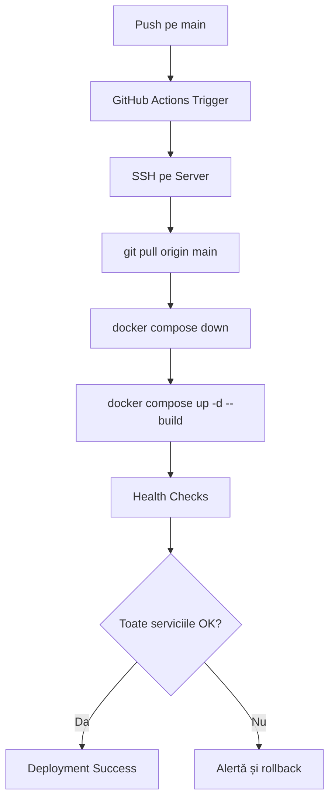

# Plan: Actualizare GitHub cu Ultimele Modificări

## Context

Suntem într-un sandbox pe GitHub Codespaces și vrem să facem push pe GitHub. Modificările vor fi deploy-uite automat pe serverul de producție (ovidiuguru.online).

### Diferențe Sandbox vs Production

| Aspect        | Sandbox (Codespaces)         | Production                 |
| ------------- | ---------------------------- | -------------------------- |
| Docker        | ❌ Nu este suportat          | ✅ Containere Docker       |
| MongoDB       | MongoDB Atlas (cloud)        | MongoDB local în container |
| Microservicii | Procese separate (localhost) | Containere Docker          |
| Domeniu       | localhost:3000               | ovidiuguru.online          |
| HTTPS         | Nu                           | Da (Cloudflare)            |

## Audit de Securitate

### ✅ Fișiere corect ignorate în `.gitignore`

| Fișier           | Conținut                  | Status     |
| ---------------- | ------------------------- | ---------- |
| `.env`           | Credențiale MongoDB Atlas | ✅ Ignorat |
| `.env.sandbox`   | Credențiale sandbox       | ✅ Ignorat |
| `.kilocode/.env` | Token GitHub              | ✅ Ignorat |

### ⚠️ Token GitHub expus în documentație

Fișierul [`plans/fix-github-token-exposure.md`](plans/fix-github-token-exposure.md:9) conținea un token GitHub expus.

**ACȚIUNE NECESARĂ**: Token-ul a fost revocat și eliminat din documentație!

### ⚠️ Credențiale MongoDB Atlas în `.env`

Fișierul `.env` (ignorat de git) conține credențiale MongoDB Atlas.

**Status**: ✅ Nu va fi comis (ignorat în `.gitignore`)

## Probleme de Rezolvat înainte de Push

### 1. Workflow Deploy.yml folosește PM2, nu Docker

Fișierul [`.github/workflows/deploy.yml`](.github/workflows/deploy.yml:50) folosește PM2:

```yaml
pm2 restart all
```

Dar pe production vrem să folosim Docker:

```yaml
docker compose -f docker-compose.production.yml up -d
```

### 2. Verificare compatibilitate cod

Clientul [`client/config.js`](client/config.js:8) detectează automat mediul:

```javascript
// Detectează automat hostname și port
const portSuffix = port ? `:${port}` : '';
return `${protocol}//${hostname}${portSuffix}/api/auth-service`;
```

**Status**: ✅ Compatibil cu ambele medii

## Plan de Acțiune

### Pasul 1: Audit de Securitate

- [ ] Verifică că `.env` nu este staged pentru commit
- [ ] Verifică că `.kilocode/.env` nu este staged pentru commit
- [ ] Verifică că `.env.sandbox` nu există sau este ignorat

### Pasul 2: Actualizare Workflow Deploy

- [ ] Modifică `.github/workflows/deploy.yml` pentru Docker
- [ ] Adaugă health checks pentru containere
- [ ] Configurează variabile de mediu din GitHub Secrets

### Pasul 3: Verificare Fișiere Modificate

- [ ] Listează toate fișierele modificate
- [ ] Verifică că nu conțin secrete
- [ ] Exclude fișierele de test temporare

### Pasul 4: Commit și Push

- [ ] Creează commit cu mesaj descriptiv
- [ ] Push pe branch-ul main
- [ ] Verifică că workflow-ul pornește

### Pasul 5: Verificare Deployment

- [ ] Verifică log-urile workflow-ului
- [ ] Testează aplicația pe production
- [ ] Verifică health endpoints

## Workflow Docker Propus

```yaml
name: Deploy to Production

on:
  push:
    branches:
      - main
  workflow_dispatch:

jobs:
  deploy:
    runs-on: ubuntu-latest

    steps:
      - name: Checkout code
        uses: actions/checkout@v4

      - name: Deploy to server
        uses: appleboy/ssh-action@v1.0.3
        with:
          host: ${{ secrets.SERVER_HOST }}
          username: ${{ secrets.SERVER_USER }}
          key: ${{ secrets.SERVER_SSH_KEY }}
          port: 22
          script: |
            cd /root/MERN-template

            echo "🔄 Pulling latest code..."
            git pull origin main

            echo "🐳 Stopping existing containers..."
            docker compose -f docker-compose.production.yml down

            echo "🏗️ Building and starting containers..."
            docker compose -f docker-compose.production.yml --env-file .env.production up -d --build

            echo "⏳ Waiting for services to start..."
            sleep 15

            echo "✅ Checking container status..."
            docker compose -f docker-compose.production.yml ps

            echo "🏥 Running health checks..."
            curl -f http://localhost:3000/health || echo "⚠️ Main server health check failed"

            echo "🎉 Deployment complete!"
```

## Secrete Necesare în GitHub

| Secret           | Descriere                       |
| ---------------- | ------------------------------- |
| `SERVER_HOST`    | IP-ul sau domeniul serverului   |
| `SERVER_USER`    | User SSH (ex: root)             |
| `SERVER_SSH_KEY` | Cheia privată SSH               |
| `SECRET_ACCESS`  | JWT secret pentru access token  |
| `SECRET_REFRESH` | JWT secret pentru refresh token |
| `GAME_PASSWORD`  | Parola de acces la joc          |
| `WEB_ORIGIN`     | Domeniul de producție           |

## Diagrama Fluxului de Deployment



## Riscuri și Mitigări

| Risc                               | Mitigare                                   |
| ---------------------------------- | ------------------------------------------ |
| Secrete expuse în git              | `.gitignore` configurat corect             |
| Token GitHub expus în documentație | Revocare token și actualizare documentație |
| Docker nu pornește pe production   | Health checks și rollback automat          |
| Variabile de mediu lipsă           | Verificare înainte de deployment           |

---

**Status**: ✅ Plan completat - gata pentru execuție în Code Mode
**Următorul pas**: Switch to Code mode pentru commit și push

## Modificări Efectuate

### 1. Workflow Deploy.yml Actualizat pentru Docker

- Eliminat PM2, adăugat Docker Compose
- Health checks pentru toate serviciile

### 2. Bug Fix: Porturi Microservicii

În [`server/server.js`](server/server.js:75):

- **Înainte**: AUTH=3200, NEWS=3100 (GREȘIT!)
- **După**: AUTH=3100, NEWS=3200 (CORECT!)

### 3. Health Check Endpoint Adăugat

În [`server/server.js`](server/server.js:58):

- Endpoint `/health` pentru monitorizare

### 4. Curățare Secrete din Documentație

- Token GitHub eliminat din [`plans/fix-github-token-exposure.md`](plans/fix-github-token-exposure.md)
- Credențiale eliminate din [`docs/MONGODB_ATLAS_SETUP.md`](docs/MONGODB_ATLAS_SETUP.md)

### 5. Fișiere Șterse (conțineau credențiale)

- `server.log`, `auth.log`, `chat.log`, `economy.log`, `news.log`, `client.log`
- `logs/` (director întreg)

### 6. `.gitignore` Actualizat

Adăugat: `*.log`, `logs/`, `.envdev`

### 7. Fișier Nou: `SECURITY.md`

Documentație pentru gestionarea secretelor și politici de securitate

## Instrucțiuni pentru Code Mode

```bash
# Pasul 1: Verificare stare git
git status

# Pasul 2: Commit
git add -A
git commit -m "chore: security updates and Docker deployment

- Update deploy.yml workflow for Docker containers
- Fix microservices port mismatch (AUTH:3100, NEWS:3200)
- Add health check endpoint to main server
- Remove exposed credentials from documentation
- Add .log files to .gitignore
- Add SECURITY.md documentation
- Delete log files containing credentials
- Add .envdev to .gitignore"

# Pasul 3: Push pe GitHub
git push origin main
```
